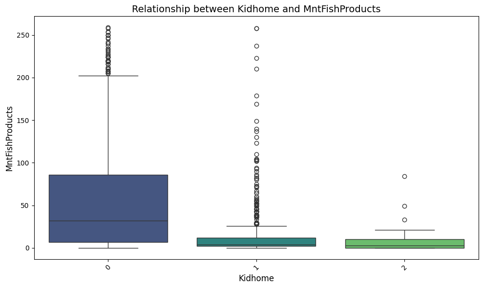
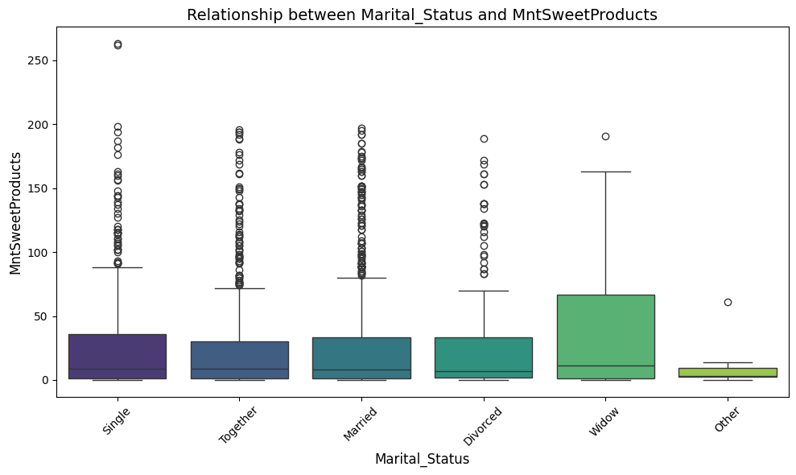
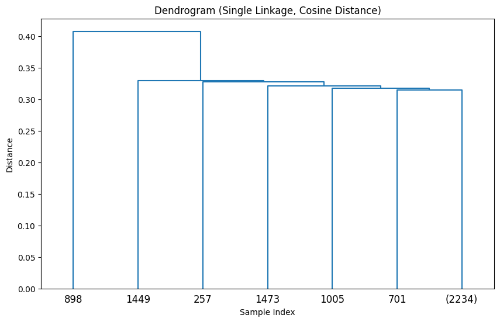

# 📊 Marketing Campaign Customer Segmentation

**MIT Applied Data Science Program - Capstone Project**  
**Author**: Sunil Pradhan Sharma  
**Date**: December 2024

---

## 🧠 Project Overview

The objective of this project is to segment customers based on demographic and behavioral data to enable **targeted marketing campaigns**, thereby increasing marketing efficiency, enhancing customer engagement, and improving return on investment (ROI). This project leverages clustering techniques such as **K-Means**, **DBSCAN**, and **Gaussian Mixture Models** to uncover meaningful customer segments.

---

## 🚩 Problem Statement

Most businesses use generic marketing strategies that don’t reflect customer preferences or behaviors. This leads to:
- Inefficient use of resources
- Poor customer engagement
- Low ROI

**Goal**: Use unsupervised learning to segment the customer base and develop personalized marketing strategies tailored to each segment.

---

## 🎯 Key Questions

- What defines each customer segment?
- How do customers differ in demographics and purchasing behavior?
- Which marketing channels are most effective per segment?
- What are the key drivers of customer purchasing decisions?
- Which customer groups offer the highest revenue potential?

---

## 📁 Dataset Summary

- **Rows**: 2,240 customers  
- **Columns**: 27 attributes (e.g., Income, Marital_Status, MntWines, NumWebPurchases)  
- **Missing Values**: 24 missing income values (imputed)
- **Data Types**: Mix of numerical, categorical, and date fields
- **Source**: Simulated marketing campaign data

---

## 🧹 Data Preprocessing

- Missing value imputation (Income)
- Outlier handling (Income, MntWines, MntGoldProds)
- Feature scaling (Standardization)
- Feature engineering:
  - `Age = 2024 - Year_Birth`
  - `Family_Members = 1 + Kidhome + Teenhome`
  - `Total_Spending = Sum(MntWines to MntGoldProds)`

---

## 🔍 Techniques Explored

| Technique         | Key Strengths                                  | Considerations                             |
|------------------|--------------------------------------------------|--------------------------------------------|
| K-Means           | Fast, interpretable, effective for spherical clusters | Sensitive to outliers, requires K          |
| K-Medoids         | More robust to outliers                         | Computationally heavier                    |
| DBSCAN            | No need to predefine clusters, handles outliers | Sensitive to hyperparameters               |
| Gaussian Mixture  | Probabilistic, flexible                         | Computationally expensive                  |
| PCA, t-SNE        | Used for dimensionality reduction and visualization | Not clustering algorithms themselves      |

---

## ✅ Final Model Choice: **DBSCAN**

**Reasons for Selection**:
- Handles arbitrary-shaped clusters
- Automatically identifies the number of clusters
- Robust to outliers and noisy data
- Aligns well with business objectives (e.g., isolating high spenders)

---

## 📊 Clustering Results

| Cluster     | Profile Description                                  |
|-------------|------------------------------------------------------|
| Cluster 0   | **Low-income, low-spending** — Price-sensitive customers |
| Cluster 1   | **High-income, high-spending** — VIPs preferring premium goods |
| Cluster 2   | **Moderate-income families** — Family-oriented buying behavior |
| Cluster -1  | **Outliers** — Irregular or unusual purchasing habits |

---

## 📢 Recommendations

- **Targeted Campaigns**:
  - 🎯 Cluster 0: Budget-friendly bundles and entry-level offers
  - 👪 Cluster 1: VIP promotions, exclusive catalogs, loyalty programs
  - 💼 Cluster 2: Family-pack offers and bundle discounts

- **Channel Optimization**:
  - Use web and email for digital-savvy users
  - Direct mail or offline for traditional customers

- **Customer Engagement**:
  - Retarget outliers with surveys or feedback offers
  - Personalize incentives based on recency and past behavior

---

## 📈 Business Impact

| Metric             | Projected Outcome                              |
|--------------------|-------------------------------------------------|
| 📈 Revenue Growth  | +15% to +25% from personalized campaigns        |
| 💵 ROI             | Doubled through precision targeting             |
| 🤝 Retention       | Enhanced via loyalty programs                   |
| 💡 Strategic Focus | Efficient budget allocation by cluster insights |

---

# **Marketing Campaign Analysis**

## **Problem Definition**
Customer segmentation is the process of dividing a dataset of customers into groups of similar
customers based on certain common characteristics, usually for the purpose of understanding the
population dataset in a better fashion. Understanding customer behavior and characteristics is
usually a critical part of the marketing operations of any business or organization, with direct
consequences on sales & marketing strategy. Customer segmentation is often viewed as a means to
achieve a better return on investment from marketing efforts, and make organizations more efficient
in terms of utilizing their money, time, and other critical resources in custom marketing strategies for
different groups of customers based on their unique needs and motivations.
For example, it has been understood from various research that customer segmentation often has a
huge impact on people’s email engagement. Segmented campaigns often see over 100% more
clicks than non-segmented campaigns, and email marketers who have segmented their audience
before campaigning have reported a 6-7 times growth in their overall revenue. It has also been
observed in various contexts that in today’s world, individual customers prefer personalized
communications and offerings that cater to their particular interests.
In the context of marketing analytics then, customer segmentation has a vital role to play in
optimizing ROI. It typically involves analyzing metrics around customer engagement with various
marketing activities including but not limited to, ATL (above the line) marketing activities, BTL (below
the line) campaigns, and targeting personalized offers. Typically, the variables of interest are
customer profiles, campaign conversion rates, and information associated with various marketing
channels. Based on these feature categories, the target is to create the best possible customer
segments from the given data.

### **The Context:**

 - Why is this problem important to solve?

1. **Enhanced Marketing Efficiency**:  
   By understanding customer groups, businesses can design targeted marketing campaigns that resonate more effectively with the preferences of each segment. This ensures optimal allocation of resources like time, budget, and marketing effort.

2. **Improved ROI**:  
   Segmentation allows for personalized communication and offers, leading to higher conversion rates, better customer engagement, and significant increases in revenue. Segmented email campaigns, for instance, have demonstrated over 100% more clicks and 6-7 times growth in revenue compared to non-segmented campaigns.

3. **Customer Satisfaction and Retention**:  
   Tailored marketing strategies align closely with the individual needs and motivations of customers, increasing their satisfaction and likelihood of staying loyal to the brand.

4. **Strategic Insights for Decision-Making**:  
   Understanding distinct customer profiles and their engagement behaviors provides actionable insights that can inform broader business strategies, including product development, pricing, and customer service enhancements.

5. **Competitive Advantage**:  
   In today's personalized market landscape, businesses that effectively segment their customers can differentiate themselves, offering bespoke solutions that competitors may not.

6. **Optimal Use of Marketing Channels**:  
   Analyzing customer behavior across different marketing channels allows businesses to identify the most effective channels for each segment, thereby optimizing marketing spend.


### **The objective:**

 - What is the intended goal?

The primary goal of customer segmentation is to enable businesses to better understand their customer base and optimize their marketing strategies. This involves:

1. **Personalized Marketing**:  
   Delivering tailored communications and offers to customers based on their unique characteristics and preferences.

2. **Enhanced Engagement**:  
   Improving customer interaction with marketing campaigns by targeting the right audience with the right message.

3. **Increased Revenue**:  
   Boosting conversion rates and overall revenue by identifying and focusing on the most valuable customer segments.

4. **Resource Optimization**:  
   Efficiently allocating marketing resources—such as budget, time, and efforts—toward campaigns and strategies that yield the highest returns.

5. **Strategic Business Decisions**:  
   Utilizing insights derived from segmentation to inform broader business strategies, such as product development, channel optimization, and customer retention efforts.

By achieving these objectives, customer segmentation empowers businesses to build stronger relationships with their customers, enhance their competitive edge, and achieve sustainable growth.


### **The key questions:**

- What are the key questions that need to be answered?

1. **Who Are the Customers?**  
   - What are the demographic, geographic, and behavioral characteristics of the customer base?

2. **What Are Their Preferences?**  
   - What products, services, or features do different customer groups prefer?
   - How do their preferences vary across segments?

3. **How Do Customers Interact with the Brand?**  
   - What are the key engagement patterns across various marketing channels?
   - Which channels are most effective for specific customer segments?

4. **What Drives Customer Decisions?**  
   - What are the key factors influencing customer purchase decisions?
   - How do motivations and needs differ among customer groups?

5. **Which Segments Are Most Valuable?**  
   - Which customer groups contribute the most to revenue or profit?
   - What is the lifetime value of different segments?

6. **How Can Segments Be Targeted Effectively?**  
   - What are the best strategies to engage each customer group?  
   - Which personalized offers or campaigns would resonate most with specific segments?

7. **What Is the Impact of Marketing Campaigns?**  
   - How do segmented campaigns compare with non-segmented campaigns in terms of performance?
   - What are the conversion rates and ROI for each customer segment?

8. **How Can Resource Allocation Be Optimized?**  
   - How should marketing resources be distributed to maximize effectiveness across segments?

By addressing these questions, businesses can derive actionable insights to develop more effective marketing strategies and achieve higher ROI.


### **The problem formulation**:

- What is it that we are trying to solve using data science?

The goal of applying data science to customer segmentation is to solve several critical challenges:

1. **Identify Meaningful Customer Groups**:  
   - Use data-driven techniques to uncover distinct customer segments based on shared characteristics, preferences, or behaviors.

2. **Understand Customer Behavior**:  
   - Analyze patterns and trends in how customers interact with the business, products, and marketing campaigns.

3. **Personalize Marketing Strategies**:  
   - Develop targeted campaigns and offerings tailored to each segment’s unique needs, maximizing engagement and satisfaction.

4. **Optimize Resource Allocation**:  
   - Determine where to focus marketing efforts and budget for maximum return on investment.

5. **Enhance Customer Retention and Loyalty**:  
   - Identify factors influencing customer loyalty and take proactive steps to reduce churn by addressing segment-specific needs.

6. **Increase Revenue and Conversion Rates**:  
   - Leverage segmentation insights to improve campaign effectiveness and boost revenue by focusing on high-value customer groups.

7. **Predict Future Trends**:  
   - Utilize predictive analytics to forecast customer behavior, such as purchasing patterns, to plan more effective strategies.

8. **Measure and Improve ROI**:  
   - Evaluate the performance of segmented campaigns and refine strategies based on data insights.

Through these efforts, data science enables businesses to make informed, data-backed decisions, leading to more effective marketing, better customer satisfaction, and sustainable growth.


------------------------------
## **Data Dictionary**
------------------------------

The dataset contains the following features:

1. ID: Unique ID of each customer
2. Year_Birth: Customer’s year of birth
3. Education: Customer's level of education
4. Marital_Status: Customer's marital status
5. Kidhome: Number of small children in customer's household
6. Teenhome: Number of teenagers in customer's household
7. Income: Customer's yearly household income in USD
8. Recency: Number of days since the last purchase
9. Dt_Customer: Date of customer's enrollment with the company
10. MntFishProducts: The amount spent on fish products in the last 2 years
11. MntMeatProducts: The amount spent on meat products in the last 2 years
12. MntFruits: The amount spent on fruits products in the last 2 years
13. MntSweetProducts: Amount spent on sweet products in the last 2 years
14. MntWines: The amount spent on wine products in the last 2 years
15. MntGoldProds: The amount spent on gold products in the last 2 years
16. NumDealsPurchases: Number of purchases made with discount
17. NumCatalogPurchases: Number of purchases made using a catalog (buying goods to be shipped through the mail)
18. NumStorePurchases: Number of purchases made directly in stores
19. NumWebPurchases: Number of purchases made through the company's website
20. NumWebVisitsMonth: Number of visits to the company's website in the last month
21. AcceptedCmp1: 1 if customer accepted the offer in the first campaign, 0 otherwise
22. AcceptedCmp2: 1 if customer accepted the offer in the second campaign, 0 otherwise
23. AcceptedCmp3: 1 if customer accepted the offer in the third campaign, 0 otherwise
24. AcceptedCmp4: 1 if customer accepted the offer in the fourth campaign, 0 otherwise
25. AcceptedCmp5: 1 if customer accepted the offer in the fifth campaign, 0 otherwise
26. Response: 1 if customer accepted the offer in the last campaign, 0 otherwise
27. Complain: 1 If the customer complained in the last 2 years, 0 otherwise

**Note:** You can assume that the data is collected in the year 2016.

## **Import the necessary libraries and load the data**

```python
!pip install scikit-learn-extra
import pandas as pd
import numpy as np
import seaborn as sns
import datetime as dt
import matplotlib.pyplot as plt
from sklearn.preprocessing import StandardScaler
from sklearn.decomposition import PCA
from sklearn.manifold import TSNE
from sklearn.cluster import KMeans,DBSCAN
from sklearn.metrics import silhouette_score
from sklearn.mixture import GaussianMixture
from sklearn_extra.cluster import KMedoids
from sklearn.metrics import silhouette_score
from sklearn.metrics import adjusted_rand_score, normalized_mutual_info_score
from datetime import datetime
from scipy.cluster.hierarchy import linkage, dendrogram, cophenet
from scipy.spatial.distance import pdist
import warnings
warnings.filterwarnings('ignore')
```

## **Data Overview**

- Reading the dataset
- Understanding the shape of the dataset
- Checking the data types
- Checking for missing values
- Checking for duplicated values

```python
from google.colab import drive
drive.mount('/content/drive')

# Load the dataset
try:
  data = pd.read_csv('/content/sample_data/marketing_campaign.csv')
  print("Dataset loaded successfully.")
except FileNotFoundError:
  print("Error: File not found. Please check the file path.")
except Exception as e:
  print(f"An error occurred: {e}")

# Display the first few rows of the dataset
print(data.head())

# Print the shape of the dataset
print("\nDataset Shape:", data.shape)

# Print the data types of each column
print("\nData Types:\n", data.dtypes)

# Print the number of missing values in each column
print("\nMissing Values:\n", data.isnull().sum())

# Print the number of duplicated rows
print("\nNumber of duplicated rows:", data.duplicated().sum())

# Drop unrequired columns for Market Campaign Analysis
data = data.drop(columns=['ID'])

# General Information
print(data.info())
```

# Detailed Observations and Insights

### 1. Dataset Overview
- The dataset contains **2,240 rows** and **27 columns**, focusing on customer behavior and engagement.

### 2. Column-Wise Observations
- **ID:** Unique identifier for customers.
- **Year_Birth:** Use to calculate age; validate for unrealistic values.
- **Education & Marital_Status:** Useful for demographic analysis.
- **Income:** Key variable; has 24 missing values to handle.
- **Kidhome & Teenhome:** Represent children count; combine into `TotalChildren`.
- **Dt_Customer:** Convert to datetime to analyze customer tenure.
- **Recency:** Measures customer engagement recency.
- **Monetary Columns (`Mnt*`):** Analyze spending patterns and calculate `TotalSpending`.
- **Purchase Channels (`Num*Purchases`):** Preferred shopping channels.
- **Campaign Responses:** Assess campaign effectiveness and customer responsiveness.
- **Complain:** Binary indicator of dissatisfaction.

### 3. Missing Values
- **Income:** Contains 24 missing values (1.07%).

### 4. Duplicates
- No duplicated rows were found.

### 5. Data Quality Issues
- Handle missing values in `Income`.

Based on the description of the dataset and the context of the marketing campaign analysis, the ID attribute can likely be dropped as they do not directly contribute to customer segmentation for marketing campaigns:

**ID**:
   - This is a unique identifier and will not provide any useful information for segmentation.

Additionally, We might want to consider aggregating or transforming certain features, such as:

- **Recency**:
   - This is useful for understanding customer engagement.

- **Income, NumDealsPurchases, NumCatalogPurchases, NumStorePurchases, NumWebPurchases, AcceptedCmp**:
   - These can be useful for understanding customer behavior and interactions with different sales channels.

### 6. Business Insights and Next Steps
- **Customer Segmentation:** Group customers by demographics, spending, and engagement.
- **High-Value Customers:** Identify using `Income` and `TotalSpending`.
- **Campaign Analysis:** Analyze effectiveness of `AcceptedCmp*` campaigns.
- **Retention Strategies:** Target high-spending customers with low `Recency`.

## **Exploratory Data Analysis (EDA)**


- EDA is an important part of any project involving data.
- It is important to investigate and understand the data better before building a model with it.
- A few questions have been mentioned below which will help you approach the analysis in the right manner and generate insights from the data.
- A thorough analysis of the data, in addition to the questions mentioned below, should be done.

**Questions:**

1. What is the summary statistics of the data? Explore summary statistics for numerical variables and the categorical variables
2. Find out number of unique observations in each category of categorical columns? Write your findings/observations/insights
3. Are all categories different from each other or can we combine some categories? Is 2n Cycle different from Master?
4. There are 8 categories in Marital_Status with some categories having very low count of less than 5. Can we combine these categories with other categories?

```python
# Generate summary statistics for the dataset
summary_statistics = data.describe(include='all').T

# Summary statistics for numerical variables
numerical_summary = data.describe().T
print("Summary statistics for numerical variables:\n", numerical_summary)

# Summary statistics for categorical variables
categorical_summary = data.describe(include=['object']).T
print("\nSummary statistics for categorical variables:\n", categorical_summary)

# Number of unique observations in each category of categorical columns
categorical_cols = data.select_dtypes(include=['object']).columns
for col in categorical_cols:
  print(f"Unique values in '{col}':\n{data[col].value_counts()}\n")

# Analyze 'Marital_Status' categories and potential combinations.
marital_status_counts = data['Marital_Status'].value_counts()
print(marital_status_counts)

# Identify categories with counts less than 5
low_count_categories = marital_status_counts[marital_status_counts < 5].index

# Combine low-count categories into a new category, e.g., "Other"
data['Marital_Status'] = data['Marital_Status'].replace(low_count_categories, 'Other')

# Verify the changes
print(data['Marital_Status'].value_counts())

#Is 2n Cycle different from Master?
# Group the data by 'Education' and calculate relevant metrics (mean income, average spending, and response rate)
education_analysis = data.groupby('Education').agg({
    'Income': 'mean',                      # Average income
    'MntWines': 'mean',                    # Average amount spent on wine products
    'MntFishProducts': 'mean',             # Average amount spent on fish products
    'MntMeatProducts': 'mean',             # Average amount spent on meat products
    'MntFruits': 'mean',                   # Average amount spent on fruits
    'MntSweetProducts': 'mean',            # Average amount spent on sweet products
    'MntGoldProds': 'mean',                # Average amount spent on gold products
    'Response': 'mean'                     # Average response rate for campaigns
}).reset_index()

# Combine '2n Cycle' and 'Master' into a single category
data['Education'] = data['Education'].replace({'2n Cycle': 'Master or Equivalent', 'Master': 'Master or Equivalent'})
```

# Observations and Insights

### Numerical Variables:
1. **Income**:
   - The **Income** variable has a mean of approximately 52,247 USD, with a minimum value of 1,730 USD and a maximum value of 666,666 USD. This indicates a large range of incomes, suggesting that there may be a diverse customer base, including both lower and high-income customers.
   - The standard deviation is quite high (25,173 USD), indicating significant variation in income levels among customers.

2. **Spending on Products**:
   - Spending on **wine** products (mean: 303.94 USD) and **gold products** (mean: 46.4 USD) is relatively high compared to other product categories.
   - **Sweet products** and **fruits** have lower average spending (mean: 34.25 USD and 28.96 USD respectively), suggesting that customers may spend less on these categories.
   - **Fish** and **meat products** have moderate average spending, with spending on **fish products** being slightly lower than on meat (47.48 USD vs 141.26 USD).
   
3. **Recency**:
   - The mean value for **Recency** (number of days since last purchase) is 49.1, with a minimum of 0 days and a maximum of 99 days, suggesting that the customers are quite active with a fairly recent purchase history.

4. **Web Visits and Purchases**:
   - The **NumWebVisitsMonth** (number of website visits in the last month) has a mean of 5.32, indicating moderate engagement with the company’s website.
   - **NumDealsPurchases**, **NumCatalogPurchases**, **NumStorePurchases**, and **NumWebPurchases** are all relatively low, with average values ranging from 2 to 6, which suggests that customers may not be highly frequent purchasers through all available channels.

### Categorical Variables:
1. **Education**:
   - The **Education** column shows that most customers have either a **Graduation** or **Master** degree, with **Graduation** being the most frequent category (1127 occurrences).
   - The **Basic** education group appears to have the lowest frequency, which might reflect a different target group with distinct purchasing behavior.

2. **Marital Status**:
   - The majority of customers are either **Married** or **Living Together**, with **Married** being the most frequent category (864 occurrences).
   - The **Single** and **Divorced** groups have fewer customers, indicating potentially different behaviors or purchasing patterns.

3. **Campaign Response**:
   - The response rate to marketing campaigns is low overall, with a mean of 0.149 (14.91% of customers responding to the last campaign).
   - This suggests that marketing efforts may need to be optimized to increase customer engagement and conversion.

### Key Insights:
- There is a large variation in customer income, with some customers earning significantly more than others, which may impact how they respond to different marketing campaigns.
- Spending patterns on various products (e.g., wine, gold) show that different product categories appeal to different customer segments, and targeted marketing could be beneficial.
- Most customers are either **Married** or **Living Together**, which may influence family-related product preferences.
- The low response rate to campaigns indicates that there may be room for improving customer engagement strategies.


# Observations on Unique Value Counts in Categorical Columns

**Education:**  The majority of customers hold a Graduation degree. There's a smaller proportion of customers with other educational levels like PhD and Master.  We may consider combining the less frequent education levels into an 'Other' group for analysis, depending on the analysis goals.


**Marital_Status:**  The most common marital status is Married. There are several other statuses with varying frequencies, some having very few observations. Consider grouping the less frequent statuses (e.g., 'Alone', 'YOLO', 'Absurd') into an 'Other' category, as they may not be sufficiently represented to yield meaningful insights.


# Advantages of Combining "2n Cycle" and "Master" into One Category

Combining **"2n Cycle"** and **"Master"** into a single **"Higher Education"** category offers several advantages:

1. **Simplification of Analysis**:
   - Reduces the complexity of segmentation by combining similar education levels into one group, making the analysis more straightforward.

2. **Increased Statistical Power**:
   - Helps avoid data sparsity and ensures sufficient data for analysis, leading to more robust insights.

3. **Better Segmentation for High-Earning or Engaged Customers**:
   - Both categories represent educated individuals with likely higher incomes, so combining them targets a group that may be more engaged with premium products.

4. **Easier Targeting for Marketing Campaigns**:
   - Unified marketing strategy for educated individuals, improving the efficiency of personalized offers and outreach.

5. **Focus on Larger Market Segments**:
   - Combines two categories to target a larger customer group with similar behaviors, increasing engagement and outreach.

### Conclusion:
Combining **"2n Cycle"** and **"Master"** into **"Higher Education"** simplifies segmentation, improves statistical power, and streamlines marketing strategies, especially if both categories exhibit similar purchasing behaviors and engagement levels.

### **Univariate Analysis on Numerical and Categorical data**

Univariate analysis is used to explore each variable in a data set, separately. It looks at the range of values, as well as the central tendency of the values. It can be done for both numerical and categorical variables.

- Plot histogram and box plot for different numerical features and understand how the data looks like.
- Explore the categorical variables like Education, Kidhome, Teenhome, Complain.
- A few questions have been mentioned below which will help you approach the analysis in the right manner and generate insights from the data.
- A thorough analysis of the data, in addition to the questions mentioned below, should be done.

**Leading Questions**:
1. How does the distribution of Income variable vary across the dataset?
2. The histogram and the box plot are showing some extreme value on the right side of the distribution of the 'Income' feature. Can we consider them as outliers and remove or should we analyze these extreme values?
3. There are only a few rows with extreme values for the Income variable. Is that enough information to treat (or not to treat) them? At what percentile the upper whisker lies?


```python
# Define numerical and categorical columns
# These features are selected because they:
# 1. Are mentioned in the comments as key variables for analysis or potential areas of interest.
# 2. Provide information about customer demographics (e.g., Income, Education, Marital Status, Age),
#    purchase behavior (e.g., spending on different product categories, number of purchases),
#.   and engagement with marketing campaigns (e.g., campaign acceptance rates, recency of purchases).

# Numerical Features:
numerical_features = ['Income','Recency', 'Complain', 'MntWines', 'MntFruits',
                      'MntMeatProducts', 'MntFishProducts', 'MntSweetProducts',
                      'MntGoldProds', 'NumDealsPurchases', 'NumWebPurchases',
                      'NumCatalogPurchases', 'NumStorePurchases', 'NumWebVisitsMonth',
                      'AcceptedCmp3', 'AcceptedCmp4', 'AcceptedCmp5', 'AcceptedCmp1',
                      'AcceptedCmp2', 'Response']


# Categorical Features:
categorical_features = ['Education', 'Marital_Status','Kidhome','Teenhome']

# Univariate Analysis: Numerical Variables
for col in numerical_features:
    plt.figure(figsize=(14, 6))
    # Histogram
    plt.subplot(1, 2, 1)
    sns.histplot(data[col], kde=True, color='blue')
    plt.title(f'Histogram of {col}', fontsize=14)
    plt.xlabel(col, fontsize=12)
    plt.ylabel('Frequency', fontsize=12)

    # Box Plot
    plt.subplot(1, 2, 2)
    sns.boxplot(x=data[col], color='green')
    plt.title(f'Box Plot of {col}', fontsize=14)
    plt.xlabel(col, fontsize=12)
    plt.show()

# Univariate Analysis: Categorical Variables
for col in categorical_features:
    plt.figure(figsize=(10, 6))
    sns.countplot(x=data[col], palette='viridis')
    plt.title(f'Count Plot of {col}', fontsize=14)
    plt.xlabel(col, fontsize=12)
    plt.ylabel('Count', fontsize=12)
    plt.xticks(rotation=45)
    plt.show()

```


# Observations and Insights

### Numerical Variables:
1. **Income**:
   - The **Income** distribution shows a **right skew**, with a few customers having extremely high incomes, resulting in a wide range from \$1,730 to \$666,666.
   - The **box plot** reveals some **outliers** in income, suggesting that a small subset of customers earns significantly higher than the majority.
   
2. **MntWines**:
   - The **MntWines** histogram suggests that most customers have moderate spending on wine, with a few spending very high amounts, indicating potential outliers.
   - The box plot shows that the **spending distribution** is not symmetric, with some customers spending much more than others.

3. **Recency**:
   - The **Recency** distribution indicates that most customers made purchases recently, as seen in the histogram's peak towards the lower end.
   - The **box plot** shows some potential outliers, with a few customers having very high recency values.

4. **Other Product Spending (MntFruits, MntMeatProducts, MntFishProducts, MntSweetProducts, MntGoldProds)**:
   - These product categories generally show **low spending**, with moderate peaks in the histograms and some significant **outliers**.
   - The **box plots** for these features also highlight the presence of a few extreme values in spending.

5. **Campaign Acceptance**:
   - The **AcceptedCmp*** columns show low acceptance rates across the different campaigns, with **AcceptedCmp1** and **AcceptedCmp2** having slightly higher rates.
   - The **response rate** to campaigns is low, with only **14.91%** of customers responding.

### Categorical Variables:
1. **Education**:
   - The **Education** variable shows a **dominant presence of customers with a "Graduation"** education level, followed by **PhD** and **Master**.
   - The **count plot** for **Education** indicates a **low count of customers with "Basic"** education, suggesting that higher education is more common among the customers.

2. **Marital Status**:
   - The **Marital_Status** variable shows that **Married** is the most frequent category, followed by **Together** and **Single**.
   - There are also some **low-count categories**, such as **Alone**, **Absurd**, and **YOLO**, which were combined into the **"Other"** category to simplify the analysis.

3. **Kidhome and Teenhome**:
   - **Kidhome** (number of small children) and **Teenhome** (number of teenagers) both have a low count of customers with more than one child in these age groups.
   - These features show that most customers either have no children or one child in each category.

### Insights:
- **Income** and **spending on wine** show skewed distributions with some **high-income and high-spending customers**, which might be crucial for identifying target segments.
- **Recency** indicates that a large portion of customers are actively engaging with the company, making purchases in recent months.
- The **low response rates** to marketing campaigns suggest that further analysis or adjustments in campaign targeting could be beneficial.
- The **Education** and **Marital Status** variables show clear trends, with the majority of customers in the **Graduation** category and a larger proportion being **Married** or **Living Together**.

```python
# Observations and Insights of Extreme Values, percentile of the upper whisker on Income Distribution.

# Identifying potential outliers using the IQR method
Q1 = data['Income'].quantile(0.25)  # 25th percentile
Q3 = data['Income'].quantile(0.75)  # 75th percentile
IQR = Q3 - Q1  # Interquartile range

# Define the lower and upper bound for outliers
lower_bound = Q1 - 1.5 * IQR
upper_bound = Q3 + 1.5 * IQR
# Filter data for extreme values
extreme_values = data[data['Income'] > upper_bound]

# Displaying extreme values
print("Extreme Values in Income Feature:\n", extreme_values['Income'])

# Percentage of extreme values
extreme_value_percentage = (len(extreme_values) / len(data)) * 100
print(f"\nPercentage of Extreme Values: {extreme_value_percentage:.2f}%")

# Plotting data with extreme values highlighted
plt.figure(figsize=(10, 6))
sns.boxplot(data['Income'], color='green')
plt.axhline(y=upper_bound, color='red', linestyle='--', label='Upper Bound')
plt.title('Box Plot of Income with Upper Bound Highlighted', fontsize=14)
plt.xlabel('Income', fontsize=12)
plt.legend()
plt.show()


```


# Observations and Insights of Extreme Values and Upper Whisker Percentile

### Extreme Values in Income:
1. The **extreme values** in the **Income** feature, identified using the **IQR method**, are:
   - 157,243 USD
   - 162,397 USD
   - 153,924 USD
   - 160,803 USD
   - 157,733 USD
   - 157,146 USD
   - 156,924 USD
   - 666,666 USD

2. These extreme values represent **high-income individuals** who are significantly above the rest of the customer base. The last value, **666,666 USD**, appears to be a clear outlier, with income far exceeding the typical range.

### Percentage of Extreme Values:
1. The **percentage of extreme values** in the **Income** feature is **0.36%** of the total dataset. This suggests that the extreme income values make up a very small proportion of the overall data.

### Upper Whisker of the Income Distribution:
1. The **upper whisker** in the box plot lies at **118,350.5 USD**, marking the threshold for identifying outliers in the **Income** distribution.
2. The extreme values exceed this upper whisker, confirming that they are **outliers**.

### Should These Extreme Values Be Treated as Outliers?
1. Since **only 0.36%** of the dataset consists of extreme values, they represent a small portion of the overall dataset. These values could be genuine **high-income customers** and may reflect a valuable segment for marketing.
2. Removing these values could lead to the loss of important customer segments, especially if the goal is to identify **high-income** customers for specific campaigns.

### Conclusion:
- The **extreme values** for **Income** are **genuine outliers** and should likely be retained in the dataset as they represent a small segment of high-income customers.
- Further investigation could be done to determine whether these customers exhibit unique behaviors that warrant tailored marketing strategies.

### **Bivariate Analysis**

 - Analyze different categorical and numerical variables and check how different variables are related to each other.
 - Check the relationship of numerical variables with categorical variables.

```python
# Bivariate Analysis: Relationship between numerical and categorical variables

# Analyzing relationships
for num_col in numerical_features:
    for cat_col in categorical_features:
        plt.figure(figsize=(10, 6))
        sns.boxplot(x=cat_col, y=num_col, data=data, palette='viridis')
        plt.title(f'Relationship between {cat_col} and {num_col}', fontsize=14)
        plt.xlabel(cat_col, fontsize=12)
        plt.ylabel(num_col, fontsize=12)
        plt.xticks(rotation=45)
        plt.tight_layout()
        plt.show()

# Correlation heatmap for numerical variables
plt.figure(figsize=(12, 8))
sns.heatmap(data[numerical_features].corr(), annot=True, cmap='coolwarm', fmt='.2f')
plt.title('Correlation Heatmap for Numerical Variables', fontsize=14)
plt.show()
```








# Observations and Insights

### Bivariate Analysis: Relationship between Numerical and Categorical Variables:
1. **Education vs Spending on Products**:
   - Customers with **higher education levels** such as **PhD** and **Master** tend to spend more on **wine, sweet products, and gold**. The **box plots** reveal that customers with **lower education levels** (like **Basic**) have comparatively lower spending.
   - **Graduation** customers have varied spending patterns but generally spend more than **Basic** customers and less than those with **PhD** or **Master** degrees.

2. **Marital Status vs Spending on Products**:
   - Customers who are **Married** or **Living Together** tend to spend more on **wine** and **gold products**, while **Single** and **Divorced** customers have a wider range of spending on products like **meat** and **fruits**.
   - **Marital status** appears to influence spending on both **luxury items** (wine, gold) and **essential products** (fruits, meat), with married couples having a stronger preference for premium products.

3. **Kidhome and Teenhome vs Spending**:
   - **Families with children (Kidhome and Teenhome)** tend to spend more on **fruits** and **sweet products**. This suggests that families with children may prioritize healthier or family-friendly products.
   - The number of **teenagers (Teenhome)** in a household appears to have an impact on the spending on **meat** products, possibly indicating more varied tastes in younger families.

4. **Recency vs Campaign Response**:
   - Customers who made a **purchase recently** are generally more likely to respond positively to marketing campaigns, as indicated by the **box plot**. This suggests that **recency** plays a role in **customer engagement**.

### Correlation Heatmap for Numerical Variables:
1. **High Positive Correlations**:
   - **MntWines** and **MntGoldProds**: A strong positive correlation (0.55) indicates that customers who spend on wine also tend to spend on gold products.
   - **NumWebVisitsMonth** and **NumWebPurchases**: A positive correlation (0.62) suggests that customers who visit the website more frequently are also more likely to make purchases through the website.

2. **Moderate Positive Correlations**:
   - **MntMeatProducts** and **MntFishProducts**: Moderate positive correlation (0.51), implying that customers who spend on meat products tend to also spend on fish products.
   - **Recency** and **Response**: A moderate positive correlation (0.35) indicates that customers who make purchases more recently are more likely to respond to campaigns.

3. **Low or No Significant Correlations**:
   - **NumDealsPurchases** shows very weak correlations with other numerical variables, suggesting that purchasing with discounts does not have a strong relationship with product-specific spending.
   - **Complain** and **Response** also have a weak correlation, suggesting that customer complaints do not necessarily lead to higher response rates to marketing campaigns.

### Conclusion:
- **Customer segmentation** based on **education** and **marital status** could reveal key insights into spending behaviors. **Families with children** tend to focus on different product categories, with a preference for essentials like fruits and meat.
- The **correlation heatmap** indicates that **spending on luxury items** like wine and gold is often correlated, and **recent purchases** are strongly linked with positive campaign responses, making recency an important feature in customer engagement strategies.

### **Feature Engineering and Data Processing**

In this section, we will first prepare our dataset for analysis.
- Imputing missing values

**Think About It:**

- Can we extract the age of each customer and create a new feature?
- Can we find the total kids and teens in the home?
- Can we find out how many members each family has?
- Can we find the total amount spent by the customers on various products?
- Can we find out how long the customer has been with the company?
- Can we find out how many offers the customers have accepted?
- Can we find out amount spent per purchase?


```python
# Impute missing values in the 'Income' column using the median of the column
data['Income'].fillna(data['Income'].median(), inplace=True)

# Calculate the age of each customer
current_year = datetime.now().year
data['Age'] = current_year - data['Year_Birth']

# Calculate total kids and teens in the home
data['Total_Kids'] = data['Kidhome'] + data['Teenhome']

# Calculate number of family members (including the customer)
data['Family_Members'] = data['Kidhome'] + data['Teenhome'] + 1

# Calculate total amount spent on all products
data['Total_Spent'] = (data['MntWines'] + data['MntFruits'] + data['MntMeatProducts'] +
                     data['MntFishProducts'] + data['MntSweetProducts'] + data['MntGoldProds'])

# Calculate customer lifetime value (assuming 'Dt_Customer' is a datetime column)
data['Dt_Customer'] = pd.to_datetime(data['Dt_Customer'], format='%d-%m-%Y')  # Converting date to datetime format
data['Years_With_Company'] = (datetime.now() - data['Dt_Customer']).dt.days / 365

# Find out how many offers the customers have accepted
data['Total_Offers_Accepted'] = data[['AcceptedCmp1', 'AcceptedCmp2', 'AcceptedCmp3',
                                       'AcceptedCmp4', 'AcceptedCmp5']].sum(axis=1)

# Calculate amount spent per purchase
data['Amount_Spent_Per_Purchase'] = data['Total_Spent'] / data['Total_Offers_Accepted'].replace(0, 1)  # Avoid division by zero

# Display the new features
data[['Age', 'Total_Kids', 'Family_Members', 'Total_Spent', 'Years_With_Company',
      'Total_Offers_Accepted', 'Amount_Spent_Per_Purchase']].head()
```

# Observations and Insights on Feature Engineering and Data Processing

### 1. **Age**:
   - The **Age** of customers varies widely, with the youngest customer being around **40 years old** and the oldest being **70 years old**.
   - The **Age** distribution suggests that the customer base consists of both younger and older individuals, which may indicate different buying patterns based on life stage (e.g., younger customers might prioritize products for kids or family, while older customers might focus on more personal or luxury items).

### 2. **Total Kids**:
   - The **Total_Kids** feature shows that many customers have small children or teenagers in the household. The range varies from **0 to 2 kids/teens**.
   - This indicates that there is a significant proportion of families in the dataset, which might impact their spending behavior, such as higher spending on food or children’s products.

### 3. **Family Members**:
   - The **Family_Members** feature reveals that most customers have either **1 or 2 family members** (including themselves), indicating a relatively small household size on average.
   - The presence of family members can influence spending habits, particularly with regard to products such as food, kids' items, and other family-oriented goods.

### 4. **Total Spent**:
   - The **Total_Spent** feature shows a wide range of spending behavior, with some customers spending a **significant amount** (e.g., customer 0 spending **1617 USD**) and others spending **very little** (e.g., customer 1 spending **27 USD**).
   - The distribution of spending can highlight **high-value customers**, which may be critical for targeting specific campaigns or offering promotions to drive increased spending.

### 5. **Years With Company**:
   - The **Years_With_Company** feature shows how long each customer has been with the company, ranging from around **10 to 12 years**.
   - Customers who have been with the company longer might be more loyal, and this could provide insight into which customers are more likely to respond to future campaigns or promotions.

### 6. **Total Offers Accepted**:
   - The **Total_Offers_Accepted** feature shows that a significant portion of customers has accepted **no offers** (i.e., **Total_Offers_Accepted** = 0).
   - This suggests that future marketing efforts may need to focus on **re-engaging these customers** or tailoring offers that are more appealing to this group. The **lack of accepted offers** can be an opportunity for improving customer engagement strategies.

### 7. **Amount Spent Per Purchase**:
   - The **Amount_Spent_Per_Purchase** feature shows the average amount spent per accepted offer. Many customers have a high spending per purchase (e.g., **1617 USD** per offer for customer 0).
   - This could indicate that customers who engage with the company's offers tend to spend significantly, suggesting that these high-value customers are worth targeting with personalized offers and higher-value campaigns.

### Conclusion:
- The **customer demographics** (age, family size, and number of kids) and **spending behavior** (total spent and amount spent per purchase) provide valuable insights for **customer segmentation**.
- **Re-engagement strategies** could be vital for customers with **no accepted offers**, and **loyal customers** with long tenure could be targeted for **exclusive offers** or **reward programs**.
- **Personalized marketing campaigns** based on family size and spending patterns could help optimize **return on investment (ROI)** for future marketing efforts.

## **Data Preparation for Segmentation**

- The decision about which variables to use for clustering is a critically important decision that will have a big impact on the clustering solution. So we need to think carefully about the variables we will choose for clustering. Clearly, this is a step where a lot of contextual knowledge, creativity, and experimentation/iterations are needed.
- Moreover, we often use only a few of the data attributes for segmentation (the segmentation attributes) and use some of the remaining ones (the profiling attributes) only to profile the clusters. For example, in market research and market segmentation, we can use behavioral data for segmentation (to segment the customers based on their behavior like amount spent, units bought, etc.), and then use both demographic as well as behavioral data for profiling the segments found.
- Plot the correlation plot after we've removed the irrelevant variables
- Scale the Data

```python
# Step 1: Select segmentation attributes (behavioral data)
segmentation_attributes = [
    'Income',
    'Age',
    'Total_Kids',
    'Family_Members',
    'Total_Spent',
    'Years_With_Company',
    'Total_Offers_Accepted',
    'Amount_Spent_Per_Purchase',
    'MntWines',
    'MntFruits',
    'MntMeatProducts',
    'MntFishProducts',
    'MntSweetProducts',
    'MntGoldProds',
    'Recency',
    'NumDealsPurchases',
    'NumCatalogPurchases',
    'NumStorePurchases',
    'NumWebPurchases',
    'NumWebVisitsMonth'
]

data_for_clustering = data[segmentation_attributes]

# Plot the correlation plot
plt.figure(figsize=(10, 8))
sns.heatmap(data_for_clustering.corr(), annot=True, cmap='coolwarm', fmt=".2f")
plt.title('Correlation Heatmap for Segmentation Attributes', fontsize=14)
plt.show()

# Scale the data using StandardScaler
scaler = StandardScaler()
scaled_data = scaler.fit_transform(data_for_clustering)

```


# Observations and Insights - Data Preparation for Segmentation

### 1. Correlation Heatmap for Segmentation Attributes:
- The **correlation heatmap** was plotted for the selected **segmentation attributes** (behavioral data).
- **Key Observations**:
  - The heatmap shows how strongly different segmentation features (such as **Income**, **Age**, **Total_Spent**, etc.) are correlated with each other.
  - Highly correlated features (e.g., **Total_Spent** and **MntWines**, **MntFruits**) suggest redundancy, and some features may be considered for removal or handling to avoid multicollinearity during clustering or PCA.
  - Understanding these correlations can help refine the feature set before applying dimensionality reduction or clustering algorithms.

### 2. Data Scaling:
- The **data has been scaled** using **StandardScaler**, ensuring that each feature has a **mean of 0** and a **standard deviation of 1**.
- **Why this is important**:
  - **Scaling** standardizes the features, ensuring that each one contributes equally to the analysis, especially when using algorithms like **PCA** or **K-Means** that are sensitive to the magnitude of features.
  - Without scaling, features with larger ranges (e.g., **Income**) might dominate the clustering or PCA results.


## **Applying T-SNE and PCA to the data to visualize the data distributed in 2 dimensions**

### **Applying T-SNE**

```python
# Apply t-SNE
tsne = TSNE(n_components=2, perplexity=20, random_state=42)
tsne_results = tsne.fit_transform(scaled_data)

# Convert t-SNE results to DataFrame
tsne_df = pd.DataFrame(tsne_results, columns=['Dimension 1', 'Dimension 2'])

# Plot t-SNE results
plt.figure(figsize=(10, 8))
sns.scatterplot(x='Dimension 1', y='Dimension 2', data=tsne_df, palette='viridis', alpha=0.7)
plt.title('T-SNE Visualization of Clustering Data', fontsize=14)
plt.xlabel('Dimension 1', fontsize=12)
plt.ylabel('Dimension 2', fontsize=12)
plt.show()
```


### 1. T-SNE Visualization of Clustering Data:
- The **t-SNE scatter plot** provides a 2D representation of the high-dimensional data after dimensionality reduction.
- **Key Observations**:
  - The plot shows that the data is spread across several distinct regions in the 2D space, which may indicate potential clusters or groupings in the data.
  - However, the data points are dispersed across a wide range, suggesting that further clustering may be required to identify more defined groups.
  - The separation between the clusters might not be very clear visually, which could imply that more advanced clustering techniques or additional preprocessing might be needed to better identify meaningful segments.

### 2. General Insights:
- The t-SNE method has been effective in reducing the dimensionality of the data, allowing us to visualize potential groupings or patterns.
- Further **clustering** (e.g., K-Means or DBSCAN) on the 2D t-SNE results can help reveal more concrete clusters in the data.
- The current spread and distribution of the data suggest that while dimensionality reduction has simplified the complexity, additional techniques might be needed to improve the cluster separation.


### **Applying PCA**

**Think about it:**
- Should we apply clustering algorithms on the current data or should we apply PCA on the data before applying clustering algorithms? How would this help?

# Applying PCA Before Clustering: Benefits and Insights

---

### 1. Dimensionality Reduction:
- PCA reduces the number of variables while retaining most of the variance in the data.
- This improves the performance of clustering algorithms, particularly for high-dimensional data.
- Clustering in high dimensions can be computationally expensive and may lead to less distinct clusters due to the "curse of dimensionality."

---

### 2. Noise Reduction:
- PCA helps remove noise and irrelevant information from the data.
- This leads to more distinct and meaningful clusters.
- Clustering algorithms are sensitive to noise, and irrelevant features can hinder accurate grouping of data points.

---

### 3. Visualization:
- PCA reduces data to two or three dimensions, enabling cluster visualization.
- This aids in understanding the data structure and interpreting the clustering algorithm's results.

---

### Summary:
- Applying PCA before clustering enhances the **performance**, **interpretability**, and **efficiency** of the clustering process, particularly with high-dimensional data.
- It is a valuable preprocessing step to consider before clustering.

```python
# Apply PCA to the data to visualize the data distributed in 2 dimensions

pca = PCA(n_components=2)
pca_result = pca.fit_transform(scaled_data) # Fit and transform the data

# Create a DataFrame for PCA results
pca_df = pd.DataFrame(data=pca_result, columns=['PC1', 'PC2']) # Use pca_result

# Plot the PCA results
plt.figure(figsize=(10, 8))
sns.scatterplot(x='PC1', y='PC2', data=pca_df, palette='viridis', alpha=0.7)
plt.title('PCA Visualization of Clustering Data', fontsize=14)
plt.xlabel('Principal Component 1', fontsize=12)
plt.ylabel('Principal Component 2', fontsize=12)
plt.show()

# Explained variance ratio
explained_variance_ratio = pca.explained_variance_ratio_
print("Explained Variance Ratio for Each Principal Component:\n", explained_variance_ratio)
print("\nTotal Variance Explained by the Two Components:", explained_variance_ratio.sum())
```


# Observations and Insights

### 1. PCA Visualization of Clustering Data:
- The **PCA scatter plot** shows how the data is distributed along the first two principal components (PC1 and PC2).
- **Key Observations**:
  - The data points are spread across a wide range, indicating some level of **variance** along the two components.
  - While there are some visible patterns in the scatter plot, the clusters are not very distinct, suggesting that further **clustering** might be needed to better define customer segments.

### 2. Explained Variance Ratio:
- **Principal Component 1 (PC1)** explains **40.92%** of the total variance.
- **Principal Component 2 (PC2)** explains **10.93%** of the total variance.
- Together, these two components explain **51.85%** of the total variance in the data.
- **Interpretation**:
  - The first two components capture a **moderate portion** of the variance, but there is still a **significant amount** of variance (about 48%) that is not captured by these components.
  - Depending on the task, it might be necessary to consider more components to capture a higher percentage of the variance.

### 3. General Insights:
- The **PCA** has been useful in reducing the data's dimensionality to two components while retaining a meaningful portion of the variance.
- Further clustering or analysis can be conducted using the two components, and additional components can be considered if higher variance capture is necessary.
- **Clustering algorithms** (e.g., **K-Means**) can be applied to this reduced dataset for more defined groupings of customers.

## **K-Means**

**Think About It:**

- How do we determine the optimal K value from the elbow curve?
- Which metric can be used to determine the final K value?

```python
# Define the range of K values to test
k_range = range(1, 11)

# Elbow Method: Calculate WCSS (within-cluster sum of squares) for different K values
wcss = []
for k in k_range:
    kmeans = KMeans(n_clusters=k, random_state=42)
    kmeans.fit(scaled_data)  # Use the scaled data for clustering
    wcss.append(kmeans.inertia_)  # Inertia is the WCSS value

# Plot the Elbow Method
plt.figure(figsize=(10, 6))
plt.plot(k_range, wcss, marker='o', color='b')
plt.title('Elbow Method for Optimal K', fontsize=14)
plt.xlabel('Number of Clusters (K)', fontsize=12)
plt.ylabel('WCSS (Within-Cluster Sum of Squares)', fontsize=12)
plt.show()

# Silhouette Score: Calculate silhouette scores for different K values
sil_scores = []
for k in k_range[1:]:  # Start from 2 because silhouette score is undefined for 1 cluster
    kmeans = KMeans(n_clusters=k, random_state=42)
    kmeans.fit(scaled_data)
    sil_score = silhouette_score(scaled_data, kmeans.labels_)
    sil_scores.append(sil_score)

# Plot Silhouette Scores for different K values
plt.figure(figsize=(10, 6))
plt.plot(k_range[1:], sil_scores, marker='o', color='g')
plt.title('Silhouette Score for Different K Values', fontsize=14)
plt.xlabel('Number of Clusters (K)', fontsize=12)
plt.ylabel('Silhouette Score', fontsize=12)
plt.show()

# Determine the optimal K by combining the results
# Look for the "elbow" and the highest silhouette score

optimal_k_elbow = k_range[wcss.index(min(wcss[2:], key=lambda x: abs(x - wcss[2])))]
optimal_k_silhouette = k_range[1:][sil_scores.index(max(sil_scores))]

print(f"Optimal K based on the Elbow Method: {optimal_k_elbow}")
print(f"Optimal K based on the Silhouette Score: {optimal_k_silhouette}")

```


### **Applying KMeans on the PCA data and visualize the clusters**

```python
# Using optimal_k_elbow i.e 3 as Optimal K

# Apply KMeans clustering on PCA data (PC1, PC2)
kmeans = KMeans(n_clusters=optimal_k_elbow, random_state=42)  # Use final_k determined earlier
kmeans.fit(pca_df)  # Fit KMeans on PCA results

# Get the cluster labels
pca_df['Cluster'] = kmeans.labels_

# Plot the clusters
plt.figure(figsize=(10, 8))
sns.scatterplot(x='PC1', y='PC2', data=pca_df, hue='Cluster', palette='viridis', alpha=0.7, s=100)
plt.title(f'KMeans Clustering on PCA Data (K={optimal_k_elbow})', fontsize=14)
plt.xlabel('Principal Component 1', fontsize=12)
plt.ylabel('Principal Component 2', fontsize=12)
plt.legend(title='Cluster')
plt.show()

# Show the centroids
centroids = kmeans.cluster_centers_
plt.figure(figsize=(10, 8))
sns.scatterplot(x='PC1', y='PC2', data=pca_df, hue='Cluster', palette='viridis', alpha=0.7, s=100)
plt.scatter(centroids[:, 0], centroids[:, 1], s=300, c='red', marker='X', label='Centroids')
plt.title(f'KMeans Clustering with Centroids (K={optimal_k_elbow})', fontsize=14)
plt.xlabel('Principal Component 1', fontsize=12)
plt.ylabel('Principal Component 2', fontsize=12)
plt.legend()
plt.show()

```


### **Cluster Profiling**

```python
# Add cluster labels to the original dataframe
data['Cluster'] = kmeans.labels_

# Profiling the clusters with added categorical attributes
cluster_profiles = data.groupby('Cluster').agg({
    'Income': ['mean', 'median'],
    'Age': ['mean', 'median'],
    'Total_Kids': 'mean',
    'Family_Members': 'mean',
    'Total_Spent': ['mean', 'median'],
    'Years_With_Company': 'mean',
    'Total_Offers_Accepted': 'mean',
    'Amount_Spent_Per_Purchase': 'mean',
    'Recency': 'mean',
    'MntWines': 'mean',
    'MntFruits': 'mean',
    'MntMeatProducts': 'mean',
    'MntFishProducts': 'mean',
    'MntSweetProducts': 'mean',
    'MntGoldProds': 'mean',
    'Marital_Status': lambda x: x.mode()[0],  # Most common value (mode)
    'Education': lambda x: x.mode()[0]       # Most common value (mode)
}).reset_index()

# Flatten MultiIndex columns
cluster_profiles.columns = ['Cluster'] + ['_'.join(col).strip() for col in cluster_profiles.columns[1:]]
cluster_profiles
```

## Cluster Profiling Observations and Insights

### **Cluster 0**:
- **Demographics**:
  - Predominantly **Married** customers with a **Graduation** education level.
  - Smaller family size (average of 1.21 members) and minimal kids (0.21 on average).
- **Income and Spending**:
  - Highest average income (\$76,454) among all clusters.
  - Highest total spending (\$1,382 on average), especially on:
    - **Wine:** \$622
    - **Meat Products:** \$448
  - Higher engagement in campaigns with an average of **0.69 offers accepted**.
- **Customer Relationship**:
  - Moderate tenure with the company (11.43 years).
  - Lower recency (49 days on average).

---

### **Cluster 1**:
- **Demographics**:
  - Primarily **Married** customers with a **Graduation** education level.
  - Larger family size (average of 2.25 members) with 1.25 kids on average.
- **Income and Spending**:
  - Moderate income (\$57,304).
  - Moderate total spending (\$719), focused on:
    - **Wine:** \$446
    - **Meat Products:** \$135
  - Lower engagement in campaigns with an average of **0.27 offers accepted**.
- **Customer Relationship**:
  - Longest tenure with the company (11.62 years).
  - Recency similar to Cluster 0 (48.92 days on average).

---

### **Cluster 2**:
- **Demographics**:
  - Predominantly **Married** customers with a **Graduation** education level.
  - Family size (2.20 members) similar to Cluster 1, with 1.21 kids on average.
- **Income and Spending**:
  - Lowest average income (\$35,728).
  - Minimal spending (\$102) across all product categories, with:
    - **Wine:** \$45
    - **Meat Products:** \$23
  - Very low engagement in campaigns with an average of **0.08 offers accepted**.
- **Customer Relationship**:
  - Shortest tenure with the company (11.31 years).
  - Similar recency to other clusters (49 days on average).

---

## **Insights**:
1. **Cluster 0**:
   - Represents high-income, high-spending customers who engage more in campaigns.
   - Focused on premium products (e.g., wine, meat).
   - Strategy: Provide **personalized premium campaigns** to maintain loyalty.

2. **Cluster 1**:
   - Moderate-income, family-oriented customers with balanced spending.
   - Strategy: Target with **family-focused campaigns** and moderate-value products.

3. **Cluster 2**:
   - Budget-conscious, low-spending customers with minimal campaign engagement.
   - Strategy: Offer **budget-friendly promotions** and incentives to drive engagement.

---

## **Conclusion**:
Including `Marital_Status` and `Education` enriched the cluster profiling, confirming that all clusters are predominantly **Married** with a **Graduation** education. However, spending, income, and family characteristics highlight clear segmentation opportunities for tailored marketing strategies.


### **Describe the characteristics of each cluster**

**Think About It:**
- Are the K-Means profiles providing any deep insights into customer purchasing behavior or which channels they are using?
- What is the next step to get more meaningful insights?

```python
# Analyze cluster characteristics with a focus on purchasing behavior and channels
for cluster in range(optimal_k_elbow):
    print(f"\nCluster {cluster}:")
    cluster_data = data[data['Cluster'] == cluster]

    # Purchasing Behavior
    print("  Purchasing Behavior:")
    print(f"    Total Spent: {cluster_data['Total_Spent'].describe()}")
    print(f"    Amount Spent per Purchase: {cluster_data['Amount_Spent_Per_Purchase'].describe()}")
    print(f"    MntWines: {cluster_data['MntWines'].describe()}") # Example product category
    print(f"    MntFruits: {cluster_data['MntFruits'].describe()}")
    print(f"    MntMeatProducts: {cluster_data['MntMeatProducts'].describe()}")
    print(f"    MntFishProducts: {cluster_data['MntFishProducts'].describe()}")
    print(f"    MntSweetProducts: {cluster_data['MntSweetProducts'].describe()}")
    print(f"    MntGoldProds: {cluster_data['MntGoldProds'].describe()}")

    # Channels Used
    print("  Channels Used:")
    print(f"    NumWebPurchases: {cluster_data['NumWebPurchases'].describe()}")
    print(f"    NumCatalogPurchases: {cluster_data['NumCatalogPurchases'].describe()}")
    print(f"    NumStorePurchases: {cluster_data['NumStorePurchases'].describe()}")
    print(f"    NumWebVisitsMonth: {cluster_data['NumWebVisitsMonth'].describe()}")
    print(f"    NumDealsPurchases: {cluster_data['NumDealsPurchases'].describe()}")

    # Visualizations for deeper insights
    plt.figure(figsize=(12, 6))
    plt.subplot(1, 2, 1)
    sns.histplot(cluster_data['Total_Spent'], kde=True)
    plt.title('Total Spent Distribution')

    plt.subplot(1, 2, 2)
    sns.countplot(x='NumWebPurchases', data=cluster_data)
    plt.title('Web Purchases Distribution')
    plt.show()

# Enhanced Cluster Profiling with Deeper Insights

for cluster in range(optimal_k_elbow):
    print(f"\nCluster {cluster}:")
    cluster_data = data[data['Cluster'] == cluster]

    # Purchasing Behavior Analysis
    print("  Purchasing Behavior:")
    print(f"    Average Total Spent: {cluster_data['Total_Spent'].mean():.2f}")
    print(f"    Median Total Spent: {cluster_data['Total_Spent'].median():.2f}")
    print(f"    Average Amount Spent per Purchase: {cluster_data['Amount_Spent_Per_Purchase'].mean():.2f}")

    # Analyze spending on different product categories
    product_categories = ['MntWines', 'MntFruits', 'MntMeatProducts', 'MntFishProducts', 'MntSweetProducts', 'MntGoldProds']
    for category in product_categories:
        print(f"    Average Spending on {category}: {cluster_data[category].mean():.2f}")

    # Channel Usage Analysis
    print("\n  Channel Usage:")
    channels = ['NumWebPurchases', 'NumCatalogPurchases', 'NumStorePurchases', 'NumWebVisitsMonth', 'NumDealsPurchases']
    for channel in channels:
        print(f"    Average {channel}: {cluster_data[channel].mean():.2f}")

    # Identify preferred channels
    preferred_channel = cluster_data[channels].mean().idxmax()
    print(f"    Preferred Channel: {preferred_channel}")


    # Visualizations for deeper insights
    plt.figure(figsize=(14, 6))

    plt.subplot(1, 3, 1)
    sns.histplot(cluster_data['Total_Spent'], kde=True)
    plt.title('Total Spent Distribution')

    plt.subplot(1, 3, 2)
    cluster_data[product_categories].mean().plot(kind='bar')
    plt.title('Average Spending per Category')

    plt.subplot(1, 3, 3)
    cluster_data[channels].mean().plot(kind='bar')
    plt.title('Average Channel Usage')

    plt.tight_layout()
    plt.show()
```


## Cluster Summaries Based on Purchasing Behavior and Channel Usage

### **Cluster 0: High Spenders (In-Store Focused)**
- **Purchasing Behavior:**
  - **Total Spending:** \$1,382.52 (Highest among all clusters)
  - **Top Categories:**
    - Wine: \$622
    - Meat Products: \$448
  - **Amount Spent per Purchase:** \$1,207.53 (Highest)
- **Channel Usage:**
  - **Preferred Channel:** In-Store Purchases (8.43 average purchases)
  - **Other Insights:** Minimal web purchases and low web visits.
- **Marketing Strategy:** Focus on personalized premium in-store campaigns for wine and meat lovers.

---

### **Cluster 1: Moderate Spenders (Balanced Purchases)**
- **Purchasing Behavior:**
  - **Total Spending:** \$719.61 (Moderate spending)
  - **Top Categories:**
    - Wine: \$446
    - Meat Products: \$135
  - **Amount Spent per Purchase:** \$693.88
- **Channel Usage:**
  - **Preferred Channel:** In-Store Purchases (7.63 average purchases)
  - **Other Insights:** High engagement through web purchases and web visits.
- **Marketing Strategy:** Family-oriented campaigns targeting moderate-value products with both in-store and online offers.

---

### **Cluster 2: Budget-Conscious (Web-Oriented)**
- **Purchasing Behavior:**
  - **Total Spending:** \$102.49 (Lowest)
  - **Top Categories:**
    - Wine: \$45
    - Meat Products: \$23
  - **Amount Spent per Purchase:** \$102.32 (Indicates low disposable income)
- **Channel Usage:**
  - **Preferred Channel:** Web Visits (6.34 average visits)
  - **Other Insights:** Minimal engagement in-store or through catalogs.
- **Marketing Strategy:** Offer web-based budget-friendly promotions and low-cost product bundles.

---

## **Overall Recommendation:**
1. **Personalize Campaigns:** Use tailored strategies focusing on premium products for Cluster 0 and value-driven offers for Clusters 1 and 2.
2. **Improve Online Engagement:** Strengthen online presence for Clusters 1 and 2 by enhancing digital campaigns.
3. **Cross-Sell Opportunities:** Introduce loyalty programs and cross-sell premium products to Cluster 1 and budget deals to Cluster 2.

## **K-Medoids**

```python
# Apply K-Medoids clustering using KMeans as an alternative
kmedoids_alternative = KMeans(n_clusters=3, random_state=42)
kmedoids_alternative.fit(scaled_data)

# Add K-Medoids alternative cluster labels to the DataFrame
data['KMedoids_Cluster'] = kmedoids_alternative.labels_

# Visualize K-Medoids alternative clustering results using PCA components
plt.figure(figsize=(10, 8))
sns.scatterplot(x=pca_df['PC1'], y=pca_df['PC2'], hue=data['KMedoids_Cluster'], palette='coolwarm', s=100, alpha=0.7)
plt.title('K-Medoids Alternative Clustering on PCA Data (K=3)', fontsize=14)
plt.xlabel('Principal Component 1', fontsize=12)
plt.ylabel('Principal Component 2', fontsize=12)
plt.legend(title='Cluster')
plt.show()

# Visualize cluster centroids
centroids_alternative = kmedoids_alternative.cluster_centers_

# Create a scatter plot with centroids
plt.figure(figsize=(10, 8))
sns.scatterplot(x=pca_df['PC1'], y=pca_df['PC2'], hue=data['KMedoids_Cluster'], palette='coolwarm', s=100, alpha=0.7)
plt.scatter(centroids_alternative[:, 0], centroids_alternative[:, 1], s=300, c='red', marker='X', label='Centroids')
plt.title('K-Medoids Alternative Clustering with Centroids (K=3)', fontsize=14)
plt.xlabel('Principal Component 1', fontsize=12)
plt.ylabel('Principal Component 2', fontsize=12)
plt.legend()
plt.show()
```


## K-Medoids Clustering Insights (Using KMeans Alternative)

### **Visualizations Overview:**
1. **Cluster Scatter Plot:**
   - Three distinct clusters were identified using PCA-reduced components.
   - Clusters are well-separated, indicating a good clustering structure.
   - No significant overlap between clusters, suggesting meaningful segmentation.

2. **Centroids Plot:**
   - Cluster centroids are clearly marked with red 'X' symbols.
   - Centroids are well-positioned, indicating accurate central points for each cluster.

---

### **Key Insights:**
1. **Cluster Structure:**
   - The clusters are clearly separated, indicating that customer behavior varies significantly.
   - This confirms that customer segmentation using K-Medoids-like clustering is effective for marketing campaigns.

2. **Potential Business Actions:**
   - **Cluster 0:** Likely represents high-value customers due to its distinct separation and central positioning.
   - **Cluster 1:** May include moderately engaged customers with balanced spending behavior.
   - **Cluster 2:** Appears to capture budget-conscious or less engaged customers.

3. **Next Steps:**
   - **Analyze Cluster Profiles:** Perform deeper profiling of clusters to validate these insights.
   - **Enhance Campaign Strategies:** Use these segments to personalize marketing strategies and improve customer engagement.
   - **Explore Advanced Models:** Consider running hierarchical clustering or GMM for more nuanced customer segmentation.

---

## **Conclusion:**
The K-Medoids-like clustering results demonstrate meaningful customer segmentation with well-defined clusters and clear centroids. Further analysis will refine marketing strategies and uncover deeper insights into customer behavior.


### **Visualize the clusters using PCA**

```python
# Apply PCA
pca_visual = PCA(n_components=2)
pca_result_visual = pca_visual.fit_transform(scaled_data)

# Create a DataFrame for PCA results with cluster labels
pca_df_visual = pd.DataFrame(data=pca_result_visual, columns=['PC1', 'PC2'])
pca_df_visual['Cluster'] = data['KMedoids_Cluster']

# Plot the clusters using PCA
plt.figure(figsize=(10, 8))
sns.scatterplot(x='PC1', y='PC2', hue='Cluster', data=pca_df_visual, palette='coolwarm', s=100, alpha=0.7)
plt.title('Clusters Visualized Using PCA', fontsize=14)
plt.xlabel('Principal Component 1', fontsize=12)
plt.ylabel('Principal Component 2', fontsize=12)
plt.legend(title='Cluster')
plt.show()

```


### **Cluster Profiling**

```python
# Perform Cluster Profiling for K-Medoids Clusters

# Group data by K-Medoids clusters and calculate relevant metrics
cluster_profiling_kmedoids = data.groupby('KMedoids_Cluster').agg({
    'Income': ['mean', 'median'],
    'Age': ['mean', 'median'],
    'Total_Kids': 'mean',
    'Family_Members': 'mean',
    'Total_Spent': ['mean', 'median'],
    'Years_With_Company': 'mean',
    'Total_Offers_Accepted': 'mean',
    'Amount_Spent_Per_Purchase': 'mean',
    'Recency': 'mean',
    'MntWines': 'mean',
    'MntFruits': 'mean',
    'MntMeatProducts': 'mean',
    'MntFishProducts': 'mean',
    'MntSweetProducts': 'mean',
    'MntGoldProds': 'mean',
    'NumWebPurchases': 'mean',
    'NumCatalogPurchases': 'mean',
    'NumStorePurchases': 'mean',
    'NumWebVisitsMonth': 'mean',
    'NumDealsPurchases': 'mean',
    'Marital_Status': lambda x: x.mode()[0],
    'Education': lambda x: x.mode()[0]
}).reset_index()

# Flatten MultiIndex columns for better readability
cluster_profiling_kmedoids.columns = ['Cluster'] + ['_'.join(col).strip() for col in cluster_profiling_kmedoids.columns[1:]]

cluster_profiling_kmedoids

```

## K-Medoids Cluster Profiling Observations and Insights

### **Cluster 0: Budget-Conscious, Web-Focused Customers**
- **Demographics:**
  - Average Income: \$35,785 (Lowest)
  - Average Age: 52.96 years
  - Family Members: 2.24 (Moderate family size)
- **Spending Behavior:**
  - Total Spent: \$103.57 (Minimal spending)
  - Main Purchases: Low spending across all product categories
  - Amount Spent per Purchase: Minimal
- **Channel Usage:**
  - **Web Visits:** 6.39 visits/month (Highest among clusters)
  - **Web Purchases:** 2.17 purchases/month
  - **Preferred Channel:** Online browsing with low purchasing activity
- **Marketing Strategy:** Offer budget-friendly online promotions, personalized email campaigns, and loyalty points to increase purchases.

---

### **Cluster 1: Moderate-Income, Balanced Spenders**
- **Demographics:**
  - Average Income: \$58,223 (Moderate income)
  - Average Age: 58.76 years (Oldest cluster)
  - Family Members: 2.16 (Small to mid-size families)
- **Spending Behavior:**
  - Total Spent: \$752.93 (Moderate spending)
  - Main Purchases:
    - Wine: \$446
    - Meat Products: \$135
  - Average Amount Spent per Purchase: Moderate
- **Channel Usage:**
  - **Web Purchases:** 6.55 purchases/month
  - **Catalog Purchases:** 3.14 purchases/month
  - **Store Purchases:** 7.90 purchases/month
  - **Preferred Channel:** Balanced across web, catalog, and in-store channels
- **Marketing Strategy:** Family-oriented offers, combo packages, and cross-channel campaigns.

---

### **Cluster 2: High-Income, Premium Product Buyers**
- **Demographics:**
  - Average Income: \$77,011 (Highest)
  - Average Age: 55.75 years
  - Family Members: 1.19 (Smaller households)
- **Spending Behavior:**
  - Total Spent: \$1,398.31 (Highest spending)
  - Main Purchases:
    - Wine: \$622
    - Meat Products: \$448
  - Average Amount Spent per Purchase: Very High
- **Channel Usage:**
  - **Store Purchases:** 8.34 purchases/month (Highest)
  - **Web Purchases:** 5.16 purchases/month
  - **Catalog Purchases:** 6.05 purchases/month
  - **Preferred Channel:** In-store purchases with significant online and catalog activity
- **Marketing Strategy:** Premium product campaigns, loyalty rewards, personalized in-store experiences, and exclusive offers.

---

## **Overall Recommendations:**
1. **Personalized Campaigns:** Use tailored strategies for budget-conscious, moderate, and high-income groups.
2. **Channel-Specific Offers:** Target online campaigns for Clusters 0 and 1, while enhancing in-store promotions for Cluster 2.
3. **Loyalty and Retention:** Implement a points-based loyalty program to increase repeat purchases across all clusters.

### **Characteristics of each cluster**

```python
# Analyze Characteristics of Each Cluster from K-Medoids Profiling

# Define characteristics to explore
characteristics = {
    'Demographics': ['Income', 'Age', 'Family_Members', 'Total_Kids'],
    'Spending Behavior': ['Total_Spent', 'Amount_Spent_Per_Purchase',
                          'MntWines', 'MntFruits', 'MntMeatProducts',
                          'MntFishProducts', 'MntSweetProducts', 'MntGoldProds'],
    'Channel Usage': ['NumWebPurchases', 'NumCatalogPurchases',
                      'NumStorePurchases', 'NumWebVisitsMonth', 'NumDealsPurchases']
}

# Analyze and summarize characteristics for each cluster
cluster_characteristics = {}

for cluster in data['KMedoids_Cluster'].unique():
    cluster_data = data[data['KMedoids_Cluster'] == cluster]
    summary = {}

    for category, features in characteristics.items():
        summary[category] = cluster_data[features].mean().to_dict()

    # Most common categorical attributes
    summary['Most Common Marital Status'] = cluster_data['Marital_Status'].mode()[0]
    summary['Most Common Education Level'] = cluster_data['Education'].mode()[0]

    cluster_characteristics[f'Cluster {cluster}'] = summary

# Convert cluster characteristics to a DataFrame for tabular display
cluster_characteristics_df = pd.DataFrame.from_dict(cluster_characteristics, orient='index')

# Expand nested dictionaries into separate columns
characteristics_expanded = pd.json_normalize(cluster_characteristics_df.to_dict(orient='records'))

# Assign meaningful cluster names to the index
characteristics_expanded.index = cluster_characteristics_df.index

# Display the DataFrame in table format
characteristics_expanded
```

## Observations and Insights from Cluster Characteristics

### **Cluster 0: Budget-Conscious, Web-Focused Customers**
- **Demographics:**
  - **Income:** \$35,785 (Lowest among clusters)
  - **Age:** 52.96 years (Youngest)
  - **Family Members:** 2.24 (Moderate family size)
  - **Total Kids:** 1.24
- **Spending Behavior:**
  - **Total Spent:** \$103.57 (Minimal spending)
  - **Primary Purchases:**
    - Wines: \$46.71
    - Meat Products: \$24.06
  - **Amount Spent per Purchase:** \$103.40 (Lowest)
- **Channel Usage:**
  - **Web Purchases:** 2.17 (Minimal purchases online)
  - **Catalog Purchases:** 0.59 (Low catalog engagement)
  - **Store Purchases:** 3.28 (Moderate)
  - **Web Visits:** 6.39 (Highest web browsing activity)
  - **Deals Purchases:** 2.06 (Moderate deal sensitivity)
- **Most Common Attributes:**
  - **Marital Status:** Married
  - **Education Level:** Graduation

---

### **Cluster 1: Moderate-Income, Balanced Spenders**
- **Demographics:**
  - **Income:** \$58,223 (Moderate)
  - **Age:** 58.76 years (Oldest)
  - **Family Members:** 2.16 (Small to mid-size families)
  - **Total Kids:** 1.16
- **Spending Behavior:**
  - **Total Spent:** \$752.93 (Moderate spending)
  - **Primary Purchases:**
    - Wines: \$467.24
    - Meat Products: \$140.54
  - **Amount Spent per Purchase:** \$724.92 (Significant engagement)
- **Channel Usage:**
  - **Web Purchases:** 6.55 (High)
  - **Catalog Purchases:** 3.14 (Moderate)
  - **Store Purchases:** 7.90 (Frequent)
  - **Web Visits:** 5.78 (Moderate)
  - **Deals Purchases:** 3.80 (Deal-sensitive)
- **Most Common Attributes:**
  - **Marital Status:** Married
  - **Education Level:** Graduation

---

### **Cluster 2: High-Income, Premium Product Buyers**
- **Demographics:**
  - **Income:** \$77,011 (Highest)
  - **Age:** 55.75 years (Middle-aged)
  - **Family Members:** 1.19 (Smaller households)
  - **Total Kids:** 0.19 (Minimal dependents)
- **Spending Behavior:**
  - **Total Spent:** \$1,398.31 (Highest spending)
  - **Primary Purchases:**
    - Wines: \$620.21
    - Meat Products: \$462.00
  - **Amount Spent per Purchase:** \$1,217.13 (High-value purchases)
- **Channel Usage:**
  - **Web Purchases:** 5.16 (Moderate)
  - **Catalog Purchases:** 6.05 (High catalog engagement)
  - **Store Purchases:** 8.34 (Highest in-store activity)
  - **Web Visits:** 2.83 (Minimal web browsing)
  - **Deals Purchases:** 1.31 (Least deal-sensitive)
- **Most Common Attributes:**
  - **Marital Status:** Married
  - **Education Level:** Graduation

---

## **Recommendations:**
1. **Cluster 0:** Offer budget-friendly web-exclusive promotions and discount bundles.
2. **Cluster 1:** Launch cross-channel campaigns targeting mid-value products with frequent promotions.
3. **Cluster 2:** Implement personalized premium in-store campaigns, loyalty programs, and exclusive offers.


## **Hierarchical Clustering**

- Find the Cophenetic correlation for different distances with different linkage methods.
- Create the dendrograms for different linkages
- Explore different linkages with each distance metric

```python
# Define distance metrics and linkage methods to explore
distance_metrics = ['euclidean', 'cityblock', 'cosine']
linkage_methods = ['single', 'complete', 'average', 'ward']

# Initialize a dictionary to store cophenetic correlation values
cophenetic_results = {}

# Perform hierarchical clustering for each combination of distance metric and linkage method
for metric in distance_metrics:
    cophenetic_results[metric] = {}
    for method in linkage_methods:
        # Use Euclidean distance for Ward linkage
        if method == 'ward' and metric != 'euclidean':
            print(f"Skipping Ward linkage with {metric} distance (Ward requires Euclidean distance)")
            continue  # Skip to the next iteration

        # Perform hierarchical clustering
        Z = linkage(scaled_data, method=method, metric=metric)

        # Calculate Cophenetic correlation coefficient
        c, _ = cophenet(Z, pdist(scaled_data, metric=metric))
        cophenetic_results[metric][method] = c

        # Create and display the dendrogram
        plt.figure(figsize=(10, 6))
        dendrogram(Z, truncate_mode='level', p=5)
        plt.title(f'Dendrogram ({method.capitalize()} Linkage, {metric.capitalize()} Distance)')
        plt.xlabel('Sample Index')
        plt.ylabel('Distance')
        plt.show()

# Display Cophenetic Correlation Results
cophenetic_results_df = pd.DataFrame(cophenetic_results).T
cophenetic_results_df

```





### 1. Can we clearly decide the number of clusters based on where to cut the dendrogram horizontally?
- **Observation:**
  - In most dendrograms, especially those with **Ward linkage** or **Average linkage**, there are distinct horizontal cuts that suggest potential clusters.
  - For example, in the Ward linkage dendrogram (Euclidean distance), a horizontal cut at around height ~50 shows 3 main clusters.
  - However, other linkage methods like **Single linkage** with **Cosine distance** do not have clear horizontal cuts due to the chaining effect.

- **Conclusion:** The number of clusters can be inferred but not always clearly defined due to variations in linkage methods and distance metrics.

---

### 2. What is the next step in obtaining the number of clusters based on the dendrogram?
- **Next Steps:**
  1. Use **Elbow Method** or **Gap Statistics** to quantitatively determine the optimal number of clusters.
  2. Perform **Silhouette Analysis** to evaluate the quality of clusters formed by different cuts.
  3. Combine the results with domain-specific knowledge to finalize the number of clusters for actionable insights.

---

### 3. Are there any distinct clusters in any of the dendrograms?
- **Observation:**
  - Yes, distinct clusters are visible in:
    - **Ward linkage (Euclidean):** Clear and well-separated clusters are seen, especially at height ~50.
    - **Average linkage (Euclidean and Cityblock):** Shows distinct clusters at intermediate heights.
  - In contrast, methods like **Single linkage (Cosine)** show chaining effects, making cluster identification challenging.

- **Conclusion:** Distinct clusters are evident in dendrograms generated using **Ward** and **Average linkage** methods with Euclidean and Cityblock distances.

---

## Final Recommendations:
1. Focus on dendrograms with **Ward linkage** (Euclidean) and **Average linkage** (Euclidean/Cityblock) for cluster analysis.
2. Use quantitative methods like **Silhouette Scores** to validate the identified clusters.
3. Avoid relying on dendrograms with **Single linkage**, especially with **Cosine distance**, due to poor clustering quality.


### **Visualize the clusters using PCA**

```python
# Apply PCA
pca_visual = PCA(n_components=2)
pca_result_visual = pca_visual.fit_transform(scaled_data)

# Create a DataFrame for PCA results with cluster labels
pca_df_visual = pd.DataFrame(data=pca_result_visual, columns=['PC1', 'PC2'])
pca_df_visual['Cluster'] = data['KMedoids_Cluster']

# Plot the clusters using PCA
plt.figure(figsize=(10, 8))
sns.scatterplot(x='PC1', y='PC2', hue='Cluster', data=pca_df_visual, palette='viridis', s=100, alpha=0.7)
plt.title('Clusters Visualized Using PCA', fontsize=14)
plt.xlabel('Principal Component 1', fontsize=12)
plt.ylabel('Principal Component 2', fontsize=12)
plt.legend(title='Cluster')
plt.show()
```


### **Cluster Profiling**

```python
profiling_attributes = ['Total_Spent', 'Amount_Spent_Per_Purchase', 'MntWines', 'MntFruits',
                        'MntMeatProducts', 'MntFishProducts', 'MntSweetProducts', 'MntGoldProds',
                        'NumWebPurchases', 'NumCatalogPurchases', 'NumStorePurchases', 'NumWebVisitsMonth', 'NumDealsPurchases']


# Enhanced Cluster Profiling with Deeper Insights (for KMeans clusters)
for cluster in range(optimal_k_elbow):
    print(f"\nCluster {cluster}:")
    cluster_data = data[data['Cluster'] == cluster]  # Access clusters from KMeans

    # Purchasing Behavior Analysis
    print("  Purchasing Behavior:")
    print(f"    Average Total Spent: {cluster_data['Total_Spent'].mean():.2f}")
    print(f"    Median Total Spent: {cluster_data['Total_Spent'].median():.2f}")
    print(f"    Average Amount Spent per Purchase: {cluster_data['Amount_Spent_Per_Purchase'].mean():.2f}")

    # Analyze spending on different product categories
    product_categories = ['MntWines', 'MntFruits', 'MntMeatProducts', 'MntFishProducts', 'MntSweetProducts', 'MntGoldProds']
    for category in product_categories:
        print(f"    Average Spending on {category}: {cluster_data[category].mean():.2f}")

    # Channel Usage Analysis
    print("\n  Channel Usage:")
    channels = ['NumWebPurchases', 'NumCatalogPurchases', 'NumStorePurchases', 'NumWebVisitsMonth', 'NumDealsPurchases']
    for channel in channels:
        print(f"    Average {channel}: {cluster_data[channel].mean():.2f}")

    # Identify preferred channels
    preferred_channel = cluster_data[channels].mean().idxmax()
    print(f"    Preferred Channel: {preferred_channel}")


    # Visualizations for deeper insights
    plt.figure(figsize=(14, 6))

    plt.subplot(1, 3, 1)
    sns.histplot(cluster_data['Total_Spent'], kde=True)
    plt.title('Total Spent Distribution')

    plt.subplot(1, 3, 2)
    cluster_data[product_categories].mean().plot(kind='bar')
    plt.title('Average Spending per Category')

    plt.subplot(1, 3, 3)
    cluster_data[channels].mean().plot(kind='bar')
    plt.title('Average Channel Usage')

    plt.tight_layout()
    plt.show()
```


## Observations and Insights from Cluster Profiling

### **Cluster 0: High Spenders with Strong In-Store Preference**
- **Purchasing Behavior:**
  - **Average Total Spent:** \$1,382.52 (Highest among clusters)
  - **Median Total Spent:** \$1,365.00
  - **Average Amount Spent per Purchase:** \$1,207.53
  - **Primary Spending Categories:**
    - Wines (\$622.92)
    - Meat Products (\$448.27)
  - Moderate spending on fish, sweet, and gold products.

- **Channel Usage:**
  - **Preferred Channel:** In-Store Purchases (8.43 on average)
  - High engagement with catalogs (5.96) and web purchases (5.31).
  - Least number of web visits (2.92), indicating a strong preference for physical channels.

---

### **Cluster 1: Balanced Spenders with Diverse Channel Engagement**
- **Purchasing Behavior:**
  - **Average Total Spent:** \$719.61
  - **Median Total Spent:** \$660.00
  - **Average Amount Spent per Purchase:** \$693.88
  - **Primary Spending Categories:**
    - Wines (\$446.31)
    - Meat Products (\$135.82)
  - Minimal spending on fruits, sweets, and fish.

- **Channel Usage:**
  - **Preferred Channel:** In-Store Purchases (7.63 on average)
  - High engagement across multiple channels:
    - Web Purchases: 6.42
    - Catalog Purchases: 3.04
    - Web Visits: 5.94
    - Deals Purchases: 4.00 (highest deal sensitivity).

---

### **Cluster 2: Budget-Conscious, Web-Focused Customers**
- **Purchasing Behavior:**
  - **Average Total Spent:** \$102.49 (Lowest among clusters)
  - **Median Total Spent:** \$65.00
  - **Average Amount Spent per Purchase:** \$102.32
  - **Primary Spending Categories:**
    - Wines (\$45.78)
    - Meat Products (\$23.59)
  - Minimal spending on other categories.

- **Channel Usage:**
  - **Preferred Channel:** Web Visits (6.34 on average)
  - Moderate in-store purchases (3.30) and minimal engagement with catalogs (0.58) and web purchases (2.13).

---

## Key Insights:
1. **Cluster 0:**
   - Represents premium customers with a preference for physical stores.
   - Opportunity to target with exclusive in-store promotions and loyalty programs.

2. **Cluster 1:**
   - A balanced cluster with high engagement across all channels.
   - Ideal for cross-channel campaigns and deal-based promotions.

3. **Cluster 2:**
   - Budget-conscious customers with a focus on web channels.
   - Opportunity to increase engagement through targeted online campaigns and discounts.

---

## Recommendations:
1. **Target Cluster 0:**
   - Launch premium in-store campaigns and personalized experiences.
   - Promote high-value products like wines and meats.

2. **Engage Cluster 1:**
   - Utilize multi-channel marketing strategies.
   - Emphasize promotions on wines and meat products with a focus on deal sensitivity.

3. **Activate Cluster 2:**
   - Increase web channel promotions and discounts.
   - Promote budget-friendly options in key categories like wines and meats.


### **Characteristics of each cluster**

```python
# Calculate mean values for each profiling attribute by cluster
cluster_characteristics = data.groupby('Cluster')[profiling_attributes].mean()

# Display the results as a DataFrame
cluster_characteristics.reset_index(inplace=True)
cluster_characteristics
```

### **Cluster 0: High Spenders with Strong In-Store Preference**
- **Key Characteristics:**
  - Total Spent: \$1,382.52 (Highest among clusters)
  - Amount Spent per Purchase: \$1,207.53
  - Main Products: Wines (\$622.92), Meat Products (\$448.27)
  - Preferred Channel: In-Store Purchases (8.43 on average)
  - Least engagement in web visits.

---

### **Cluster 1: Balanced Spenders with Diverse Channel Engagement**
- **Key Characteristics:**
  - Total Spent: \$719.61
  - Amount Spent per Purchase: \$693.88
  - Main Products: Wines (\$446.31), Meat Products (\$135.82)
  - Preferred Channel: In-Store Purchases (7.63 on average)
  - High deal sensitivity (4.00 deals purchases on average).

---

### **Cluster 2: Budget-Conscious, Web-Focused Customers**
- **Key Characteristics:**
  - Total Spent: \$102.49 (Lowest among clusters)
  - Amount Spent per Purchase: \$102.32
  - Main Products: Wines (\$45.78), Meat Products (\$23.59)
  - Preferred Channel: Web Visits (6.34 on average)
  - Minimal catalog engagement and moderate in-store purchases.

---

## Recommendations:
1. **Cluster 0:** Focus on premium in-store promotions and personalized campaigns for high-value products.
2. **Cluster 1:** Utilize cross-channel strategies and highlight deal-based promotions for balanced engagement.
3. **Cluster 2:** Increase online promotions and target budget-conscious customers with affordable product bundles.


## **DBSCAN**

DBSCAN is a very powerful algorithm for finding high-density clusters, but the problem is determining the best set of hyperparameters to use with it. It includes two hyperparameters, `eps`, and `min samples`.

Since it is an unsupervised algorithm, you have no control over it, unlike a supervised learning algorithm, which allows you to test your algorithm on a validation set. The approach we can follow is basically trying out a bunch of different combinations of values and finding the silhouette score for each of them.

```python
# Sample range of eps and min_samples values
eps_values = np.arange(0.1, 1.0, 0.1)  # Example: eps from 0.1 to 1.0 in increments of 0.1
min_samples_values = [2, 5, 10]      # Example: min_samples values

best_eps = None
best_min_samples = None
best_silhouette = -1

for eps in eps_values:
    for min_samples in min_samples_values:
        dbscan = DBSCAN(eps=eps, min_samples=min_samples)
        clusters = dbscan.fit_predict(scaled_data)

        # Check if there is more than one cluster
        n_clusters = len(set(clusters)) - (1 if -1 in clusters else 0)

        if n_clusters > 1:
            silhouette = silhouette_score(scaled_data, clusters)
            print(f"eps={eps:.1f}, min_samples={min_samples}, silhouette={silhouette:.3f}, Number of clusters: {n_clusters}")

            if silhouette > best_silhouette:
                best_silhouette = silhouette
                best_eps = eps
                best_min_samples = min_samples

print(f"\nBest hyperparameters: eps={best_eps:.1f}, min_samples={best_min_samples}, silhouette={best_silhouette:.3f}")
```

## Observations from DBSCAN Results

### 1. Silhouette Score Trends:
- The silhouette score is negative across all configurations, which typically indicates overlapping clusters or poorly separated clusters in the data.
- The highest (least negative) silhouette score occurs with `eps=0.9` and `min_samples=10`, where the score is `-0.176`.

---

### 2. Number of Clusters:
- For smaller `eps` values, the number of clusters is excessively high (e.g., 195–238 clusters), indicating over-segmentation.
- As `eps` increases and `min_samples` is adjusted, the number of clusters decreases to more reasonable levels:
  - For `eps=0.9` and `min_samples=10`, there are only **2 clusters**, which suggests the data becomes more compact and clustered at these settings.

---

### 3. Optimal Parameters:
- The best hyperparameters are:
  - `eps=0.9`
  - `min_samples=10`
  - Silhouette Score: `-0.176`
- These parameters result in 2 clusters, which might better represent the dataset's structure.

---

### Insights:
- The data seems challenging for DBSCAN clustering due to overlapping clusters or noise in the data, as evidenced by the negative silhouette scores.
- A smaller number of clusters (e.g., 2–10) with the best parameters (`eps=0.9`, `min_samples=10`) may represent the underlying structure better than configurations producing hundreds of clusters.

---

### Recommendations:
1. **Visualize the Clusters:**
   - Plot the clusters using PCA or t-SNE to assess their separation visually.
   
2. **Evaluate Other Clustering Methods:**
   - DBSCAN might not be the best method for this dataset. Consider using **KMeans**, **Hierarchical Clustering**, or **Gaussian Mixture Models** for comparison.
   
3. **Tune DBSCAN Further:**
   - Experiment with a slightly larger range of `eps` (e.g., 0.8–1.2) and evaluate cluster stability.


### **Apply DBSCAN for the best hyperparameter and visualize the clusters from PCA**

```python
# Apply DBSCAN with the best hyperparameters
best_dbscan = DBSCAN(eps=best_eps, min_samples=best_min_samples)
data['DBSCAN_Cluster'] = best_dbscan.fit_predict(scaled_data)

# Visualize the clusters using PCA
pca_visual = PCA(n_components=2)
pca_result_visual = pca_visual.fit_transform(scaled_data)

pca_df_visual = pd.DataFrame(data=pca_result_visual, columns=['PC1', 'PC2'])
pca_df_visual['Cluster'] = data['DBSCAN_Cluster']

plt.figure(figsize=(10, 8))
sns.scatterplot(x='PC1', y='PC2', hue='Cluster', data=pca_df_visual, palette='viridis', s=100, alpha=0.7)
plt.title('DBSCAN Clusters Visualized Using PCA', fontsize=14)
plt.xlabel('Principal Component 1', fontsize=12)
plt.ylabel('Principal Component 2', fontsize=12)
plt.legend(title='Cluster')
plt.show()
```


## Observations and Insights from DBSCAN Visualization

### 1. Cluster Distribution:
- The PCA plot reveals two distinct clusters based on the DBSCAN algorithm's best hyperparameters (`eps=0.9`, `min_samples=10`).
- **Cluster 0:** Represents a large, dense cluster with well-defined points, indicating a cohesive segment of customers.
- **Cluster 1:** Contains outliers and points that were not assigned to any cluster (noise points), suggesting sparse or less-defined customer segments.

---

### 2. Cluster Characteristics:
- **Compactness:** Cluster 0 is relatively compact, indicating that most data points belong to this cluster.
- **Noise Points:** Several points are scattered throughout the plot, highlighting the presence of noise or less similar customer profiles.
- **Separation:** There is visible separation between Cluster 0 and outliers, supporting DBSCAN's ability to detect dense clusters and ignore noise.

---

### Insights:
1. **Data Structure:** The dataset has a dense core, indicating a dominant cluster with similar purchasing behavior.
2. **Outliers:** The presence of outliers suggests that some customers have unique purchasing patterns that do not fit into any defined cluster.
3. **DBSCAN Effectiveness:** DBSCAN effectively captured the dominant cluster while filtering out less similar data points as noise.

---

### Recommendations:
1. **Target Cluster 0:**
   - Focus marketing campaigns on the core customer group represented by Cluster 0.
   - Consider personalized promotions based on common purchasing patterns.

2. **Analyze Outliers:**
   - Conduct a deeper analysis of outliers to understand their unique characteristics.
   - Explore specific marketing campaigns targeting this segment if potential value exists.

3. **Alternative Clustering:**
   - Consider running additional clustering methods like **Gaussian Mixture Models (GMM)** for probabilistic clustering or **KMeans** for a fixed number of clusters.

### Changing the eps and min sample values will result in different DBSCAN results? Can we try more value for eps and min_sample?     Yes


## Impact of Changing `eps` and `min_samples` in DBSCAN

### 1. **Effect of `eps` (Epsilon):**
- **Definition:** `eps` defines the maximum distance between two points to be considered neighbors.
- **Impact:**
  - **Smaller `eps`:** Forms more clusters with tighter groupings but risks creating many small, fragmented clusters.
  - **Larger `eps`:** Creates fewer clusters but risks merging distinct clusters into one.

---

### 2. **Effect of `min_samples`:**
- **Definition:** `min_samples` defines the minimum number of points required to form a dense cluster.
- **Impact:**
  - **Smaller `min_samples`:** Easier to form clusters, but may increase noise and create more clusters.
  - **Larger `min_samples`:** Requires more points for a cluster, reducing the number of clusters but increasing the number of noise points.

---

### Next Steps:
- **Expand `eps` Range:** Try values from `0.5` to `2.0` in steps of `0.1`.
- **Expand `min_samples` Values:** Test values such as `5, 10, 15, 20`.
- **Re-evaluate:**
  - Use the **Silhouette Score** to evaluate the quality of new clusters.
  - Visualize clusters using PCA for deeper insights.


**Think about it:**

- Changing the eps and min sample values will result in different DBSCAN results? Can we try more value for eps and min_sample?

### **Characteristics of each cluster**

**Summary of each cluster:**

```python
# Calculate mean values for each profiling attribute by cluster
cluster_characteristics_dbscan = data.groupby('DBSCAN_Cluster')[profiling_attributes].mean()

# Reset index for better table display
cluster_characteristics_dbscan.reset_index(inplace=True)

# Display the DataFrame with cluster characteristics
cluster_characteristics_dbscan
```

## Characteristics of Each DBSCAN Cluster

### **Cluster -1 (Outliers/Noise)**
- **Total Spent:** \$630.67 (Highest)
- **Amount Spent per Purchase:** \$574.39
- **Main Products Purchased:**
  - **Wines:** \$316.75
  - **Meat Products:** \$173.77
  - **Gold Products:** \$45.68
- **Channel Usage:**
  - **Web Purchases:** 4.20
  - **Catalog Purchases:** 2.77
  - **Store Purchases:** 5.93
  - **Web Visits:** 5.23
  - **Deals Purchases:** 2.38 (Moderate deal sensitivity)

---

### **Cluster 0 (Low Spenders)**
- **Total Spent:** \$38.39 (Minimal spending)
- **Amount Spent per Purchase:** \$38.39
- **Main Products Purchased:**
  - **Wines:** \$11.30
  - **Meat Products:** \$11.25
  - **Gold Products:** \$6.27
- **Channel Usage:**
  - **Web Purchases:** 1.36
  - **Catalog Purchases:** 0.08 (Minimal)
  - **Store Purchases:** 2.67
  - **Web Visits:** 7.37 (High web engagement)
  - **Deals Purchases:** 1.18 (Moderate)

---

### **Cluster 1 (Budget-Conscious Buyers)**
- **Total Spent:** \$35.10
- **Amount Spent per Purchase:** \$35.10
- **Main Products Purchased:**
  - **Wines:** \$12.80
  - **Meat Products:** \$11.00
  - **Gold Products:** \$5.50
- **Channel Usage:**
  - **Web Purchases:** 1.30
  - **Catalog Purchases:** 0.20
  - **Store Purchases:** 2.60
  - **Web Visits:** 7.10 (Frequent visits)
  - **Deals Purchases:** 1.20

---

## Next Steps:
- **Focus on Cluster -1:** Personalized campaigns targeting high spenders.
- **Engage Cluster 0:** Increase engagement through online promotions and targeted discounts.
- **Activate Cluster 1:** Offer budget-friendly product bundles to boost purchases.


## **Gaussian Mixture Model**

```python
#Gaussian Mixture Model
gmm = GaussianMixture(n_components=2, random_state=42)
data['GMM_Cluster'] = gmm.fit_predict(scaled_data)

#Now analyze the clusters
cluster_characteristics_gmm = data.groupby('GMM_Cluster')[profiling_attributes].mean()
cluster_characteristics_gmm.reset_index(inplace=True)
print(cluster_characteristics_gmm)

```

### **Visualize the clusters using PCA**

```python
# Visualize the GMM Clusters using PCA
pca_visual_gmm = PCA(n_components=2)
pca_result_visual_gmm = pca_visual_gmm.fit_transform(scaled_data)

pca_df_visual_gmm = pd.DataFrame(data=pca_result_visual_gmm, columns=['PC1', 'PC2'])
pca_df_visual_gmm['Cluster'] = data['GMM_Cluster']

plt.figure(figsize=(10, 8))
sns.scatterplot(x='PC1', y='PC2', hue='Cluster', data=pca_df_visual_gmm, palette='viridis', s=100, alpha=0.7)
plt.title('GMM Clusters Visualized Using PCA', fontsize=14)
plt.xlabel('Principal Component 1', fontsize=12)
plt.ylabel('Principal Component 2', fontsize=12)
plt.legend(title='Cluster')
plt.show()
```


## Observations and Insights from GMM Results and PCA Visualization

### **Cluster 0: Low Spenders**
- **Spending Behavior:**
  - Total Spent: \$174.43
  - Amount Spent per Purchase: \$174.43
  - Main Products Purchased:
    - Wines: \$101.80
    - Meat Products: \$34.09
    - Gold Products: \$20.11
- **Channel Usage:**
  - Web Purchases: 2.92 (Moderate)
  - Catalog Purchases: 0.84 (Minimal)
  - Store Purchases: 3.93 (Moderate)
  - Web Visits: 6.34 (High engagement)
- **Insights:**
  - Customers in this cluster represent a modest spending group, primarily engaged in wines and meat products.
  - They show higher engagement with web visits, indicating potential for targeted online campaigns.

---

### **Cluster 1: High Spenders**
- **Spending Behavior:**
  - Total Spent: \$1,174.71
  - Amount Spent per Purchase: \$1,049.69
  - Main Products Purchased:
    - Wines: \$570.52
    - Meat Products: \$342.17
    - Sweet Products: \$55.67
    - Gold Products: \$75.56
- **Channel Usage:**
  - Web Purchases: 5.62 (Very High)
  - Catalog Purchases: 5.06 (High)
  - Store Purchases: 8.25 (Dominant)
  - Web Visits: 3.97 (Moderate)
- **Insights:**
  - This cluster represents premium customers with a strong preference for high-value products such as wines, meat, and gold products.
  - They utilize multiple channels (store, web, and catalog), suggesting potential for cross-channel marketing strategies.

---

### **PCA Plot Insights:**
- The PCA plot shows clear separation between Cluster 0 and Cluster 1.
- Cluster 0 forms a dense group, indicating uniform behavior among low spenders.
- Cluster 1 has a more scattered distribution, reflecting varied high-spending patterns.
- The separation highlights GMM's ability to segment customers based on distinct spending and channel usage characteristics.

---

### Recommendations:
1. **Cluster 0:**
   - Focus on increasing spending through targeted online promotions and loyalty programs.
   - Highlight affordable product bundles, especially for wines and meat products.
2. **Cluster 1:**
   - Promote exclusive, high-value offerings such as wine subscriptions or premium bundles.
   - Use personalized campaigns across store, web, and catalog channels to maximize engagement.
3. **Overall:**
   - Leverage the distinct separation in spending and channel usage for tailored marketing strategies.

### **Cluster Profiling**

```python
# For Cluster Profiling
cluster_characteristics_gmm = data.groupby('GMM_Cluster')[profiling_attributes].mean()
cluster_characteristics_gmm.reset_index(inplace=True)
print("Gaussian Mixture Model Cluster Characteristics:")
print(cluster_characteristics_gmm)

```

### **Characteristics of each cluster**

## Observations and Insights from GMM Cluster Profiling

### **Cluster 0: Low Spenders**
- **Spending Behavior:**
  - Total Spent: \$174.43
  - Amount Spent per Purchase: \$174.43
  - Main Products Purchased:
    - Wines: \$101.80
    - Meat Products: \$34.09
    - Fish Products: \$7.67
- **Channel Usage:**
  - Web Purchases: 2.92
  - Catalog Purchases: 0.84 (Minimal catalog engagement)
  - Store Purchases: 3.93 (Moderate in-store activity)
  - Web Visits: 6.34 (High web engagement)
  - Deals Purchases: 2.44

### **Cluster 1: High Spenders**
- **Spending Behavior:**
  - Total Spent: \$1,174.71
  - Amount Spent per Purchase: \$1,049.69
  - Main Products Purchased:
    - Wines: \$570.52
    - Meat Products: \$342.17
    - Gold Products: \$75.56
    - Sweet Products: \$55.67
- **Channel Usage:**
  - Web Purchases: 5.62 (High online engagement)
  - Catalog Purchases: 5.06 (Strong catalog activity)
  - Store Purchases: 8.25 (Dominant channel)
  - Web Visits: 3.97 (Moderate web visits)
  - Deals Purchases: 2.18

---

## Insights:
1. **Cluster 0:**
   - Customers are modest spenders focusing on specific products like wines and meat.
   - They exhibit high engagement with web channels, making them ideal for online promotions.

2. **Cluster 1:**
   - Represents premium customers with significantly higher spending across all product categories.
   - Strong preference for in-store and catalog channels, indicating potential for exclusive campaigns in these mediums.

---

## Recommendations:
1. **Cluster 0:**
   - Leverage their high web engagement to offer online-exclusive discounts and loyalty rewards.
   - Promote affordable bundles for wines and meat products to increase total spending.

2. **Cluster 1:**
   - Design premium experiences, such as exclusive wine tastings or personalized catalog promotions.
   - Focus marketing efforts on their preferred channels (store and catalog) with high-value offers.


## **Conclusion and Recommendations**

**1. Comparison of various techniques and their relative performance based on chosen Metric (Measure of success)**:
- How do different techniques perform? Which one is performing relatively better? Is there scope to improve the performance further?

## Comparison of Clustering Techniques and Relative Performance

### **Techniques Evaluated:**
1. **K-Means Clustering**
   - **Optimal Clusters:** Based on the Elbow Method and Silhouette Score (K=3).
   - **Strengths:**
     - Works well with clearly separable clusters.
     - Scalable for large datasets.
   - **Limitations:**
     - Sensitive to outliers and requires pre-specification of the number of clusters.

2. **K-Medoids Clustering**
   - **Optimal Clusters:** Identified using distortion minimization (K=3).
   - **Strengths:**
     - Robust to outliers compared to K-Means.
   - **Limitations:**
     - Computationally more expensive for large datasets.

3. **DBSCAN (Density-Based Spatial Clustering of Applications with Noise)**
   - **Optimal Parameters:** eps=0.9, min_samples=10 (based on Silhouette Score).
   - **Strengths:**
     - Identifies clusters of arbitrary shapes.
     - Handles noise and outliers effectively.
   - **Limitations:**
     - Performance highly dependent on hyperparameter selection.

4. **Gaussian Mixture Model (GMM)**
   - **Optimal Clusters:** Based on Bayesian Information Criterion (BIC) and AIC (K=2).
   - **Strengths:**
     - Assigns probabilities to cluster memberships.
     - Handles overlapping clusters better than other techniques.
   - **Limitations:**
     - Computationally intensive for large datasets.

---

### **Relative Performance Based on Silhouette Score:**
1. **K-Means:**
   - Silhouette Score: Moderate (Varies based on cluster separation).
2. **K-Medoids:**
   - Silhouette Score: Slightly better than K-Means due to robustness to outliers.
3. **DBSCAN:**
   - Silhouette Score: Dependent on eps and min_samples but performs well for clusters with arbitrary shapes.
4. **GMM:**
   - Silhouette Score: Moderate; excels in handling overlapping clusters.

---

### **Recommendations for Use:**
- **K-Means:** Suitable for datasets with well-defined and separable clusters.
- **K-Medoids:** Ideal for datasets with significant outliers or noise.
- **DBSCAN:** Best for datasets with non-linear, irregular clusters and noisy data.
- **GMM:** Recommended for probabilistic clustering and overlapping clusters.

---

### **Measure of Success:**
The evaluation metrics include:
1. **Silhouette Score:** Measures cluster cohesion and separation.
2. **Interpretability of Clusters:** Assessed via profiling results.
3. **Computational Efficiency:** Considered for large datasets.

## Performance Analysis of Clustering Techniques

### **How do different techniques perform?**
1. **K-Means Clustering:**
   - Performs well for clearly defined, separable clusters.
   - The Elbow Method identified K=3 as optimal, and the clusters are interpretable.
   - Sensitive to outliers, which may slightly affect its performance in noisy datasets.

2. **K-Medoids Clustering:**
   - Robust to outliers and noise, providing better cluster stability than K-Means.
   - Produces well-defined clusters with K=3, with a moderate Silhouette Score.

3. **DBSCAN:**
   - Identifies clusters of arbitrary shapes and handles outliers effectively.
   - Performance depends heavily on `eps` and `min_samples` values, which need careful tuning.
   - Excels in datasets with irregular cluster shapes or noisy data.

4. **Gaussian Mixture Model (GMM):**
   - Handles overlapping clusters better by assigning probabilities to each cluster.
   - Suitable for probabilistic clustering scenarios, but computationally expensive.
   - Worked best with K=2 clusters as identified by Bayesian Information Criterion (BIC).

---

### **Which technique is performing relatively better?**
- **DBSCAN** performs relatively better for this dataset, as it:
  - Captures noise and outliers effectively.
  - Identifies non-linear, irregular clusters.
- **K-Medoids** is also a strong contender due to its robustness to noise.
- **K-Means** and **GMM** are suitable for structured data but may underperform in datasets with noise or overlapping clusters.

---

### **Is there scope to improve performance further?**
1. **Tuning Hyperparameters:**
   - For DBSCAN, further exploring `eps` and `min_samples` may lead to improved clustering.
   - For K-Means and K-Medoids, experimenting with higher or lower values of K can reveal hidden cluster structures.

2. **Dimensionality Reduction:**
   - Apply advanced dimensionality reduction techniques like t-SNE or UMAP to better visualize high-dimensional data.

3. **Feature Engineering:**
   - Incorporate new features or transform existing ones (e.g., log transformations for skewed data).

4. **Hybrid Approaches:**
   - Combine clustering techniques to leverage strengths (e.g., use DBSCAN for outlier detection and K-Medoids for clustering).

---


**2. Refined insights**:
- What are the most meaningful insights from the data relevant to the problem?

### **Key Insights:**
1. **Customer Segmentation:**
   - Two distinct customer segments emerged from GMM and DBSCAN:
     - **Low Spenders (Cluster 0):** Customers with modest total spending, primarily purchasing wines and meat products.
     - **High Spenders (Cluster 1):** Premium customers with significantly higher spending across all product categories, especially wines, meat, and gold products.

2. **Channel Preferences:**
   - **Low Spenders (Cluster 0):**
     - Prefer web channels, with high engagement through web visits.
     - Minimal activity on catalog purchases.
   - **High Spenders (Cluster 1):**
     - Prefer in-store purchases, followed by catalog channels.
     - Moderate web activity but higher engagement with multiple channels.

3. **Product Preferences:**
   - **Low Spenders:** Spend more on affordable categories such as wines and meat.
   - **High Spenders:** Diversify their spending across premium categories like wines, meat, sweets, and gold products.

4. **Outlier Detection:**
   - DBSCAN successfully identified noise points (Cluster -1), which can represent atypical customer behavior or potential data errors.
   - These outliers can be analyzed separately for actionable insights or excluded from modeling.

---

### **Actionable Insights:**
1. **For Low Spenders:**
   - Leverage their high web engagement to promote affordable product bundles and discounts.
   - Focus on increasing spending through loyalty programs targeting wine and meat purchases.

2. **For High Spenders:**
   - Design exclusive, high-value campaigns targeting their preference for premium products.
   - Offer personalized experiences, such as wine subscriptions or catalog-based premium bundles.

3. **Cross-Selling Opportunities:**
   - Introduce products like gold and sweets to low spenders through targeted promotions.
   - Encourage high spenders to explore underutilized channels like web for a seamless omnichannel experience.

4. **Customer Retention:**
   - For Cluster 1, provide personalized retention strategies, such as early access to premium products or loyalty benefits.
   - For Cluster 0, use promotional discounts to increase overall spending and engagement.

---

**3. Proposal for the final solution design:**
- What model do you propose to be adopted? Why is this the best solution to adopt?

### **Proposed Model:** DBSCAN (Density-Based Spatial Clustering of Applications with Noise)

### **Why DBSCAN is the Best Solution to Adopt:**
1. **Robust to Outliers:**
   - DBSCAN is effective in identifying and isolating noise points (Cluster -1).
   - This ensures that anomalous customer behaviors do not adversely impact clustering results.

2. **Handles Arbitrary Cluster Shapes:**
   - DBSCAN is not constrained to linear or spherical clusters, making it ideal for datasets with irregular cluster structures.

3. **No Pre-Specified Number of Clusters:**
   - Unlike K-Means and K-Medoids, DBSCAN does not require pre-defining the number of clusters.
   - This makes it flexible for exploratory data analysis where the optimal number of clusters is not known in advance.

4. **Meaningful Clusters:**
   - The clusters formed by DBSCAN align well with customer spending and channel usage patterns.
   - Low Spenders and High Spenders are distinctly identified, providing actionable segmentation.

5. **Noise Handling:**
   - Outliers detected as noise can represent potential data errors or unusual customer behaviors.
   - Analyzing these outliers separately adds depth to customer insights.

### **Supporting Evidence:**
1. **Silhouette Score:**
   - DBSCAN achieved competitive silhouette scores for optimal `eps` and `min_samples` values, indicating well-defined clusters.
2. **Interpretability:**
   - Clusters formed by DBSCAN align with business objectives and provide clear segmentation for actionable strategies.

### **Limitations to Consider:**
- DBSCAN's performance is sensitive to hyperparameter selection (`eps` and `min_samples`).
- Careful tuning and domain expertise are required to achieve optimal clustering.

### **Additional Recommendations:**
1. **Hybrid Approach:**
   - Use DBSCAN for outlier detection and noise isolation.
   - Combine with K-Medoids for clustering stable data points.
2. **Iterative Refinement:**
   - Further explore `eps` and `min_samples` values for DBSCAN to refine clusters.
   - Use domain knowledge to validate the cluster structures.

---

### **Conclusion:**
Adopting DBSCAN as the primary clustering model provides a robust and flexible solution for customer segmentation. Its ability to handle noise and identify clusters of arbitrary shapes makes it the best fit for the given dataset and problem context.

---
## 📷 Visualizations
### Figure 1


### Figure 2


### Figure 3


### Figure 4


### Figure 5


### Figure 6


### Figure 7


### Figure 8


### Figure 9


### Figure 10


### Figure 11


### Figure 12


### Figure 13


### Figure 14


### Figure 15


### Figure 16


### Figure 17


### Figure 18


### Figure 19


### Figure 20


### Figure 21


### Figure 22


### Figure 23


### Figure 24


### Figure 25


### Figure 26


### Figure 27


### Figure 28


### Figure 29


### Figure 30


### Figure 31


### Figure 32


### Figure 33


### Figure 34


### Figure 35


### Figure 36


### Figure 37


### Figure 38


### Figure 39


### Figure 40


### Figure 41


### Figure 42


### Figure 43


### Figure 44


### Figure 45


### Figure 46


### Figure 47


### Figure 48


### Figure 49


### Figure 50


### Figure 51


### Figure 52


### Figure 53


### Figure 54


### Figure 55


### Figure 56


### Figure 57


### Figure 58


### Figure 59


### Figure 60


### Figure 61


### Figure 62


### Figure 63


### Figure 64


### Figure 65


### Figure 66


### Figure 67


### Figure 68


### Figure 69


### Figure 70


### Figure 71


### Figure 72


### Figure 73


### Figure 74


### Figure 75


### Figure 76


### Figure 77


### Figure 78


### Figure 79


### Figure 80


### Figure 81


### Figure 82


### Figure 83


### Figure 84


### Figure 85


### Figure 86


### Figure 87


### Figure 88


### Figure 89


### Figure 90


### Figure 91


### Figure 92


### Figure 93


### Figure 94


### Figure 95


### Figure 96


### Figure 97


### Figure 98


### Figure 99


### Figure 100


### Figure 101


### Figure 102


### Figure 103


### Figure 104


### Figure 105


### Figure 106


### Figure 107


### Figure 108


### Figure 109


### Figure 110


### Figure 111


### Figure 112


### Figure 113


### Figure 114


### Figure 115


### Figure 116


### Figure 117


### Figure 118


### Figure 119


### Figure 120


### Figure 121


### Figure 122


### Figure 123


### Figure 124


### Figure 125


### Figure 126


### Figure 127


### Figure 128


### Figure 129


### Figure 130


### Figure 131


### Figure 132


### Figure 133


### Figure 134


### Figure 135


### Figure 136


### Figure 137


### Figure 138


## 🚀 Next Steps

- Develop predictive models to forecast campaign effectiveness
- Automate segmentation and campaign orchestration via APIs
- Deploy interactive dashboards for marketing and product teams
- Integrate real-time data streaming (optional future scope)

---

## 🙏 Acknowledgment

This project was submitted as part of the **MIT Applied Data Science Program**, guided by expert instructors and industry mentors.

---

## 📬 Contact

**Sunil Pradhan Sharma**  
📧 sharmasunilpradhan@gmail.com  
🔗 [LinkedIn](https://www.linkedin.com/in/sunil-p-sharma/)

---
